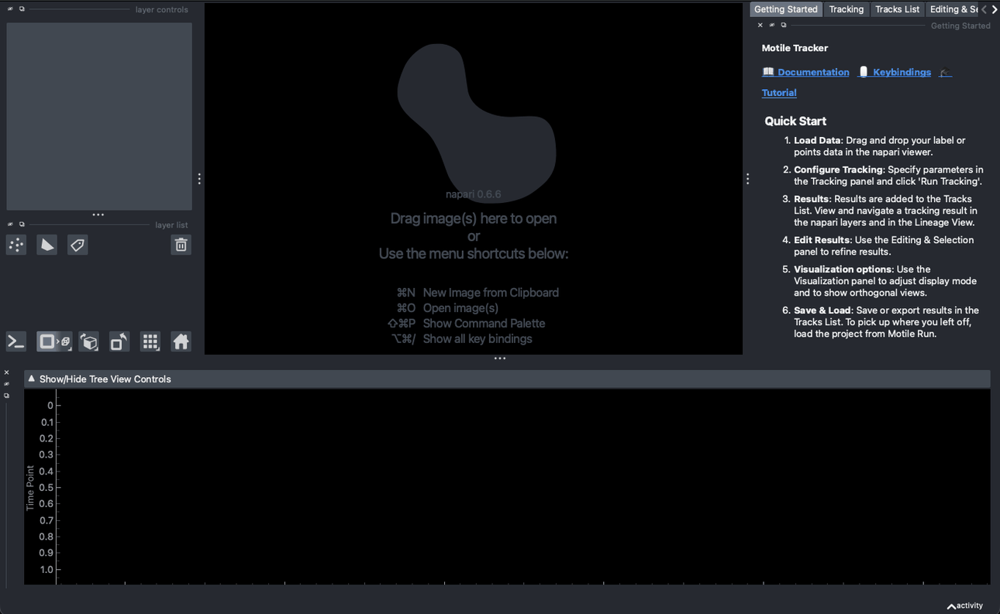
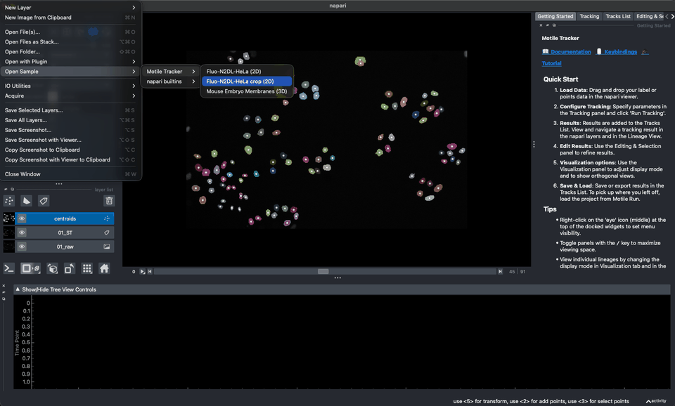
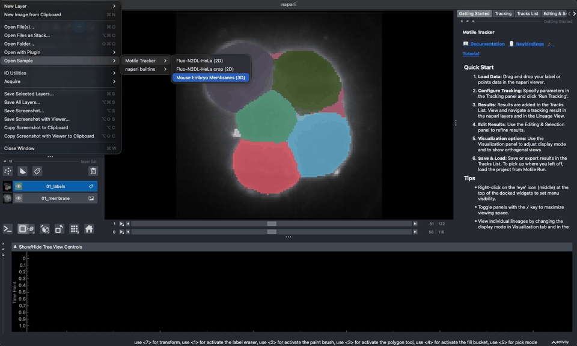
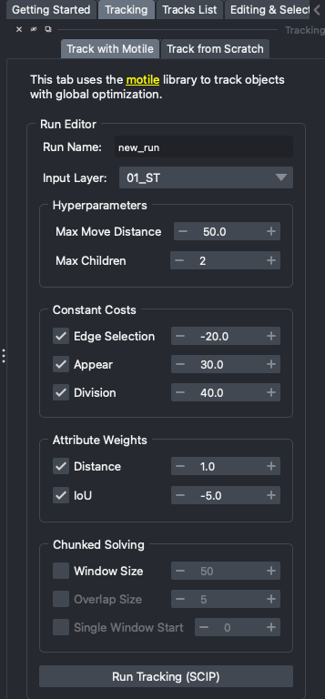
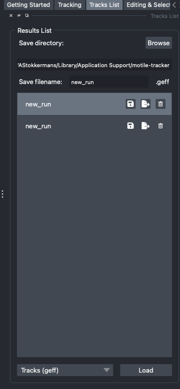
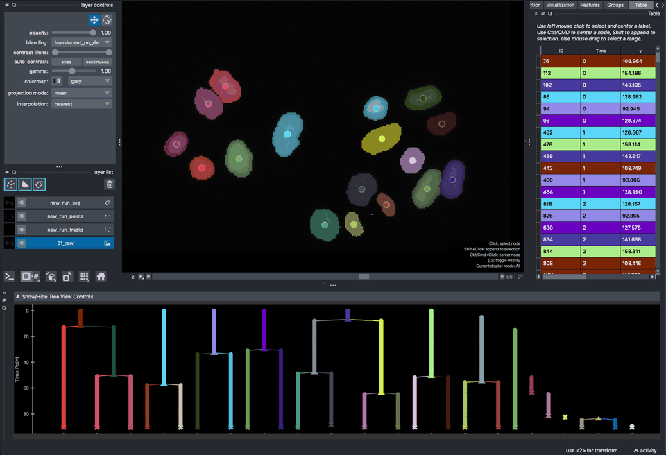
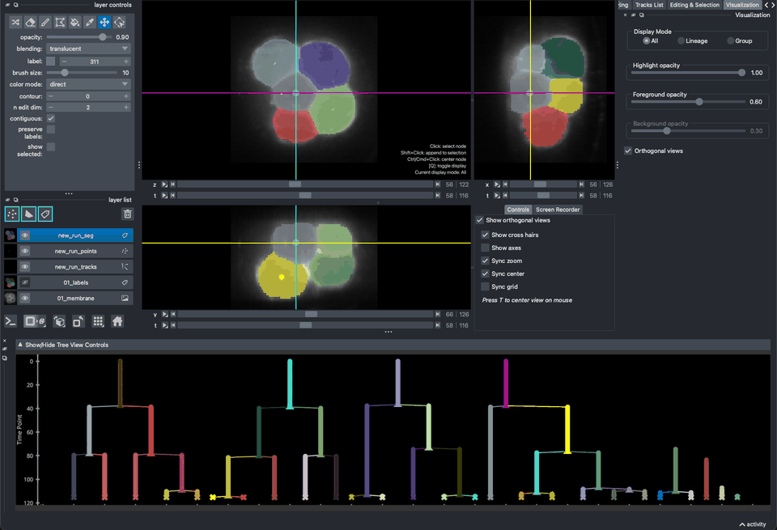
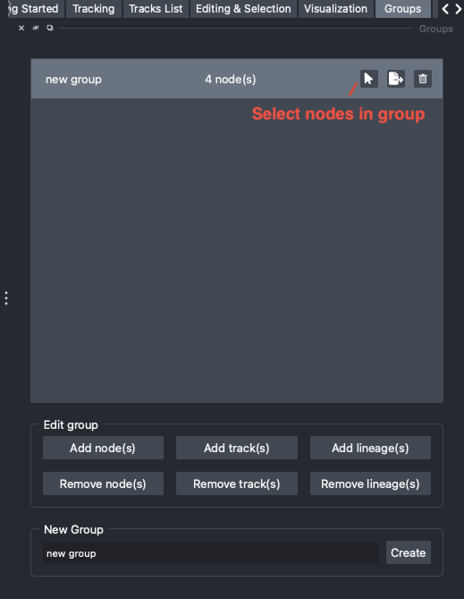
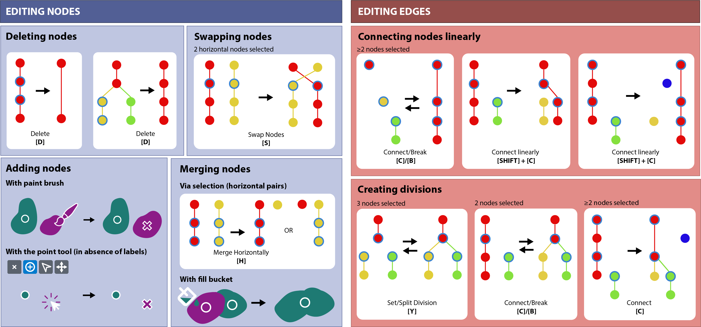
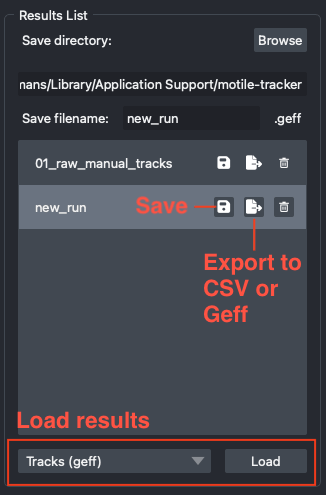

# Interactive Cell Tracking with Motile Tracker
*June 2026 - motile-tracker v5.\* - Caroline Malin-Mayor - Teun Huijben - Anniek Stokkermans*

[`Motile Tracker`](https://www.napari-hub.org/plugins/motile-tracker) is napari plugin implementing [`motile`](https://funkelab.github.io/motile/) for interactive cell tracking. You can find the full documentation [`here`](https://funkelab.github.io/motile_tracker/). Please follow the preparation instructions below before the workshop.

## Preparations

### Installing Motile Tracker

You can install the plugin via `pypi` in the environment of you choice (e.g. `venv`, `conda`) with the command
`pip install motile-tracker`.
Currently, the motile_tracker requires python >=3.11.

For example, to create a new environment with conda:

```
conda create -n motile_tracker python=3.11
conda activate motile_tracker
pip install motile-tracker
pip install pyqt6
```

To install the latest development version use:

```
pip install motile-tracker --pre
```

### Gurobi Optimizer license
Using the Gurobi Optimizer software is not strictly necessary, but it speeds up the solving. It is free for academic use. You can download the Gurobi Optimizer and request a license key [`here`](https://www.gurobi.com/features/academic-named-user-license/). If Gurobi is detected on your computer, it will automatically use it for computing the tracks. You can also install it with:

```bash
pip install motile-tracker[gurobi]
```

If you have a Gurobi license and encounter an error about license version mismatch,
you may need to install a specific version of `gurobipy` that matches your license.
Use one of the version-specific extras:

```bash
pip install motile-tracker[gurobi12]  # For Gurobi 12.x licenses
pip install motile-tracker[gurobi13]  # For Gurobi 13.x licenses
```

### Verify installation of the plugin
If your installation was successful, you should be able to find 'Motile Tracker' under `Plugins`. Please go to `Plugins > Motile Tracker > Open all widgets` to check if the start up screen looks like this:
<figure style="margin: 10px; text-align: center;">
    
    <figcaption>Motile-tracker startup screen</figcaption>
</figure>


### Downloading sample data
Two sample datasets are provided with the plugin:
- Fluo-N2DL-HeLa is a 2D dataset of images and segmentations of HeLa cells from the [`cell tracking challenge`](https://celltrackingchallenge.net/2d-datasets/).
- Mouse Embryo Membrane is a 3D dataset of images and segmentations of a membrane labeled developing early mouse embryo (4-26 cells)
from [`Fabrèges et al (2024)`](https://www.science.org/doi/10.1126/science.adh1145) available [`here`](https://zenodo.org/records/13903500).

To download and open the sample data, click `File > Open Sample > Motile Tracker > Fluo-N2DL-HeLa (2D)` and `File > Open Sample > Motile Tracker > Mouse Embryo Membranes (3D)`. This may take a few minutes. After downloading, the data will remain available in the plugin for re-use.

If you see these images after opening the sample data, you are ready to start the workshop!

<div style="display: flex; justify-content: space-around;">
    <figure style="margin: 10px; text-align: center;">
        
        <figcaption>Fluo-N2DL-HeLa (2D)</figcaption>
    </figure>
    <figure style="margin: 10px; text-align: center;">
        
        <figcaption>Mouse Embryo Membranes (3D)</figcaption>
    </figure>
</div>

## Generating Tracks

### Input data
To track objects with the plugin, you need to either provide object segmentations on a napari Labels layer or object detections on a Points layer. If your data uses anisotropic scaling, make sure that the scaling is correctly set on the layer (`layer.scale`) via the console.

### Choosing tracking parameters
Tracking parameters should be specified in the `Tracking` tab and are subdivided in hyperparameters, constant costs and attribute weights. Hovering over each of the parameters will display a tooltip, and more extensive information can be found in the documentation. Once the parameters are set, you can start the solver by clicking `Run Tracking (SCIP)`. After the solve is complete, you can find the Tracking Result in the `Tracks List` tab. Tracking Results will accumulate here for each set of parameters that you tried.

<div style="display: flex; justify-content: space-around;">
    <figure style="margin: 10px; text-align: center;">
        
        <figcaption>Enter tracking parameters</figcaption>
    </figure>
    <figure style="margin: 10px; text-align: center;">
        
        <figcaption>Tracking results</figcaption>
    </figure>
</div>

  <div style="background-color: #e6f7ff; border: 2px solid #104982; padding: 15px; border-radius: 10px;">
    <h2>Exercise 1 - Generating Tracking Results</h2>
    <p>1. Start the plugin via <code>Plugins > Motile Tracker > Open all widgets </code> </p>
    <p>2. Go to <code>File > Open Sample > Motile Tracker > Fluo-N2DL-HeLa crop (2D)</code> to open the 2D HeLa cell test dataset, or load your own segmentation data.</p>
    <p>3. To compute tracks, go to the <code>Tracking</code> tab, and choose parameters for tracking. Use '01_ST' as input layer. Consult the
    <a href="https://funkelab.github.io/motile_tracker/motile.html" target="_blank" style="color: #0073e6; text-decoration: underline;">documentation</a> to help you decide on the different values. Click <code>Run Tracking (SCIP)</code> to start the computation. After the solver has finished, you should see that the Lineage View is now populated with tracks and that the cells are relabeled.</p>
    <p>4. Click <code>Back to editing</code> and test multiple combinations of parameters. Note that you can also use the Points layer 'centroids' as input. Compare the different tracking results. Verify that you can find previous results in the <code>Tracks List</code> tab.
  </div>

## Viewing and navigating a tracking result

### Tracking views
After a tracking solution is computed, they are displayed with:
- a new **Points** layer, with nodes color-coded by tracklet ID and with symbols matching the state of the node:
  - △ dividing node
  - ✕ end point node
  - ◯ linear node
- a new **Segmentation** (Labels) layer (only if you provided a Labels layer as input), with label values matching node ids, but color-coded by tracklet ID
- a new **Tracks** layer, with tracks color-coded by tracklet ID
- a **Lineage View** with nodes and edges color-coded by tracklet ID and with symbols matching the state of nodes.
- a **Table View** with all object properties is optionally visible in the Table tab.

Optionally, you can activate orthogonal views (in the Visualization tab) to display the yz (or yt) and xz (or xt) dimensions.

<div style="display: flex; justify-content: space-around;">
    <figure style="margin: 10px; text-align: center;">
        
        <figcaption>Viewing a 2D+time tracking result</figcaption>
    </figure>
    <figure style="margin: 10px; text-align: center;">
        
        <figcaption>Viewing a 3D+time tracking result with orthogonal views enabled</figcaption>
    </figure>
</div>

### Selecting nodes and creating groups.
You can select one or multiple nodes for closer inspection. Selection of nodes is possible in the Points and Labels layers, and in the Lineage View. Selecting a node will highlight it and center the object if it is outside the viewing range. You can center the view to any node by pressing `Control` or `CMD` when clicking, without selecting that node. Holding down `Alt` (`Option` on macOS) when clicking picks up that node's Tracklet ID as the current one without selecting the node, which works like the pipette tool of the Labels layer except that the node may be in any time point, so neither the time point nor the view changes. You can append (or subtract) nodes to (from) the selection by holding down `SHIFT` when clicking. In the `Groups` tab you can create groups of nodes that you want to store to review later, for example because these are of particular interest, need to be corrected, or belong to a specific object/cell type. You can also select all nodes in a group or export them.

<div style="display: flex; justify-content: space-around;">
    <figure style="margin: 10px; text-align: center;">
        
        <figcaption>Creating groups of nodes</figcaption>
    </figure>
</div>

### Displaying selected lineages and object features
You can restrict the display to the lineages of selected nodes. To do so, press `Q` in the napari Viewer and/or in the Lineage View. To display all nodes in the current group, press `Q` once more (only available when at least one group exists — otherwise `Q` alternates between 'All' and 'Lineage'). The current viewing mode ('All', 'Lineage', 'Group') is displayed as overlay on the viewer in the right bottom corner. The `Visualization` tab offers additional controls for the opacities for highlighted, foreground (in-group), and background (out-of-group) labels. By setting the contour value (in the Labels controls) to a non-zero value, it is possible to view lineage/group nodes as filled labels, while all other nodes are displayed as contours.
The Lineage View behaves independently of the napari layers, but also here you can choose between viewing all lineages or the selected lineages. It is also possible to plot other node features, such as the object size. Press `W` in the Lineage View to toggle between the lineage view and the object feature view.

<div style="display: flex; justify-content: space-around;">
    <figure style="margin: 10px; text-align: center;">
        
        <figcaption>View selected lineages</figcaption>
    </figure>
    <figure style="margin: 10px; text-align: center;">
        
        <figcaption>View object sizes of selected lineages</figcaption>
    </figure>
</div>

<div style="background-color: #e6f7ff; border: 2px solid #104982; padding: 15px; border-radius: 10px;">
  <h2>Exercise 2 - View and explore Tracking Results</h2>
  <p>1. Explore your Tracking Result by clicking on nodes in the Points and/or Segmentation layer and in the Lineage View. You can use scroll to zoom in to specific parts of the Lineage View or of the napari layers. Use right-mouse click to reset the Lineage View.</p>
  <p>2. Try selecting multiple nodes with <code>SHIFT+CLICK</code> or <code>SHIFT+DRAG</code> (in the Lineage View and Points layer, with the 'select points'-tool active) </p>
  <p>3. Switch the Lineage View display mode to 'Lineage' to isolate viewed lineages. You can do the same for the napari layers by pressing <code>Q</code> when the napari viewer is active (click on the viewer to activate it).</p>
  <p>4. Display the object size for the lineages of selected nodes. Note that this is only possible if you have used a Labels layer as input for tracking, because points do not contain size information.</p>
  <p>5. Use the arrow buttons or arrow keys to follow nodes up or down the tree, or to jump to neighboring nodes.</p>
  <p>6. Create a group in the `Groups` tab and select and add some nodes, tracks, or lineages. Verify that you can restrict the display to the nodes in the group by changing the display mode to 'group' in the `Visualization` tab.  </p>
  <p>7. While in lineage or group display mode, change the contour value of the Segmentation layer to 1, and change the opacity settings in the `Visualization` tab to your liking.
</div>

## Editing Tracks

Predicted tracks can be corrected by deleting, adding, or modifying nodes and/or edges. You can edit the tracks using the buttons in the `Editing & Selection` tab or their corresponding keyboard shortcuts, or by editing the napari Points and Segmentation layers directly. To undo/redo an action, click `Undo`/`Redo` in the Edit Tracks menu or press `Z`/`R`. Find out more in [`documentation`](https://funkelab.github.io/motile_napari_plugin/editing.html).

<div style="display: flex; justify-content: space-around;">
    <figure style="margin: 10px; text-align: center;">
        
    </figure>
    <figure style="margin: 10px; text-align: center;">
        
    </figure>
</div>


<div style="background-color: #e6f7ff; border: 2px solid #104982; padding: 15px; border-radius: 10px;">
  <h2>Exercise 3 - Editing Tracking Results</h2>
  <p>1. Open the <code>Editing & Selection</code> tab.</p>
  <p>2. Select one or multiple nodes, and use the <code>Delete</code> button or press <code>D</code> to delete them. What happens if you:</p>
  <ul style="padding-left: 60px;">
  <li>delete a linear node?</li>
  <li>delete a dividing node? </li>
  <li>delete an end point node? </li>
  <li>delete one of the two children of a dividing node?</li>
  You can undo your actions by pressing <code>Z</code> or with the <code>Undo</code> button.
  </ul>
  <p>3. Go to the Segmentation layer ('_seg') and activate the paint brush. Press <code>M</code> to select a new label. Paint a new node and observe the Lineage View. Then move to the next time point and paint with the same color again. Observe that a new track is created as you are painting. </p>
  <p>4. Select a new node and display the object size in the Lineage View. Then paint or erase (part of) it in the Segmentation layer. Observe how this affects the object size and the centroid location.</p>
  <p>5. Select two connected nodes and use the <code>Break</code> button or press <code>B</code> to break the connection. What happens to the two fragments?
  <p>6. Select two nodes and try to create an edge between them with the <code>Add</code> button or by pressing <code>A</code>. Can you connect any two nodes? </p>
  <p>7. Select two nodes in the same time point, and press <code>S</code> to swap the predecessors of those nodes, assigning them to each other's tracks.</p>
</div>

## Saving and reopening Tracks
You can save your tracking results in the `Tracks List` tab. This will save the parameters and the tracking data. You can load your results back in at the bottom of the `Tracks List` tab by loading a Motile Run and selecting the folder. In addition, motile-tracker allows you to export the result to the `csv` and [`geff`](https://github.com/live-image-tracking-tools/geff) file formats via the export (middle) button in the Tracks List.

<div style="display: flex; justify-content: space-around;">
    <figure style="margin: 10px; text-align: center;">
        
    </figure>
</div>


<div style="background-color: #e6f7ff; border: 2px solid #104982; padding: 15px; border-radius: 10px; page-break-inside: avoid;">
  <h2>Exercise 4 - Save and load Tracking Results</h2>
  <p>1. Go to the <code>Tracks List</code> tab.</p>
  <p>2. Click the save button and save the tracks to a location on your computer.</p>
  <p>3. Click the trash can icon to delete the tracks from the list.
  <p>4. At the bottom of the <code>Tracks List</code> tab, choose <code>Motile Run</code> from the dropdown menu to load your saved tracks back into the plugin. </p>
  <p>5. Export your tracking results to csv with the export button in the Results list tab (next to the save and trash buttons). You will be asked whether to include saving the segmentation (as-is or relabeled by tracklet ID). </p>
  <p>7. At the bottom of the <code>Tracks List</code> tab, choose <code>External Tracks from CSV</code> from the dropdown menu to load the results back from the csv file. If you have tracks generated with a different (external) method, you must ensure that you have columns for the x, y, (z), id, parent_id, and time attributes and map them to the corresponding column names in the menu. If you have a segmentation image, you must also provide a segmentation id, which corresponds to the label value for each node in the segmentation image (if you exported with 'Relabel segmentation by Track ID', this value should be set to Tracklet ID). </p>
  <p>8. Export your tracking result to geff. Note that the segmentation data is included in the geff, so you do not need to save it separately.</p>
  <p>9. Load the geff via <code>External Tracks from geff</code>.

</div>

## Future features to be implemented
In the future, this plugin will be extended with additional features.
  - Allowing usage of user-defined Motile tracking parameters.
  - Recomputing tracks incorporating the manual edits from the user.
  - Fit tracking parameters based on user-provided ground truth tracks.
  - Tracking based on a multi-hypothesis segmentation input.
  - Support for viewing and editing big tracking results.

## Mouse and Keyboard bindings

### Napari viewer and layer key bindings and mouse functions

| Mouse / Key Binding | Action |
| ------------------- | ------ |
| Click on a point or label  | Select this node (center view if necessary)  |
| `SHIFT` + click on point or label  | Add this node to selection  |
| `CTRL`/`CMD` + click on point or label  | Center view on node |
| `ALT`/`OPTION` + click on point or label  | Use this node's Tracklet ID as the current one (like the pipette, but without changing selection or time point) |
| Mouse drag with point layer selection tool active  | Select multiple nodes at once   |
| `Q` | Toggle between viewing all nodes in the points/labels or only those for the currently selected lineages or groups  |
| `T` | Center orthogonal views to mouse cursor location.
| `/` | Show/hide all widgets.

### Lineage View key and mouse functions
*********************************
| Mouse / Key Binding | Action |
| ------------------- | ------ |
| Click on a point or label | Select this node (center view if necessary) |
| `SHIFT` + click on node | Add this node to selection |
| `CTRL`/`CMD` + click on node  | Center view on node |
| `ALT`/`OPTION` + click on node  | Use this node's Tracklet ID as the current one (like the pipette, but without changing selection or time point) |
| Scroll | Zoom in or out
| Scroll + `X` / Right mouse click + drag horizontally | Restrict zoom to the x-axis of the Lineage View |
| Scroll + `Y` / Right mouse click + drag vertically | Restrict zoom to the y-axis of the Lineage View |
| Mouse drag | Pan |
| `SHIFT` + Mouse drag | Rectangular selection of nodes |
| `ESC` | Reset view |
| `E` | Restore selection |
| `P` / Mouse button 4 (Back) | Go to previous selection in history (if present)
| `N` / Mouse button 5 (Next)| Go to next selection in history (if present)
| `Q` | Switch between viewing all lineages (vertically) or the currently selected lineages (horizontally) |
| `W` | Switch between plotting the lineage tree and the object size |
| `F` | Flip plot axes |
| Left arrow | Select the node to the left |
| Right arrow | Select the node to the right |
| Up arrow | Select the parent node (vertical view of all lineages) or the next adjacent lineage (horizontal view of selected lineage) |
| Down arrow | Select the child node (vertical view of all lineages) or the previous adjacent lineage (horizontal view of selected lineage) |


### Key bindings for editing Tracks
*********************************
| Mouse / Key Binding | Action |
| ------------------- | ------ |
| `D` / `Delete`   | Delete selected nodes   |
| `B` | Break edge between two selected nodes, if existing |
| `A`  | Create edge between two selected nodes, if valid  |
| `S`  | Swap the predecessors of two nodes at the same time point, if possible  |
| `Z`  | Undo last editing action |
| `R`  | Redo last editing action |
