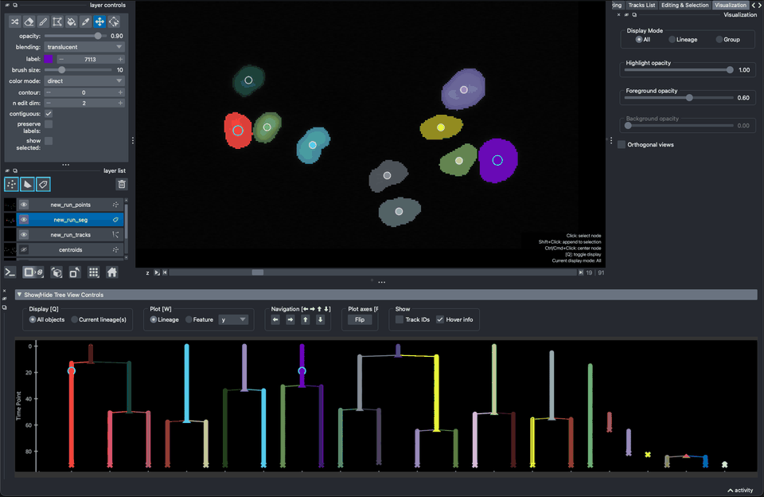
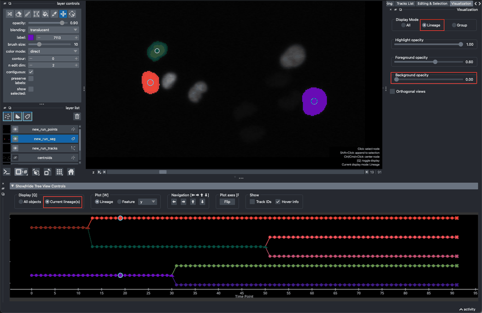
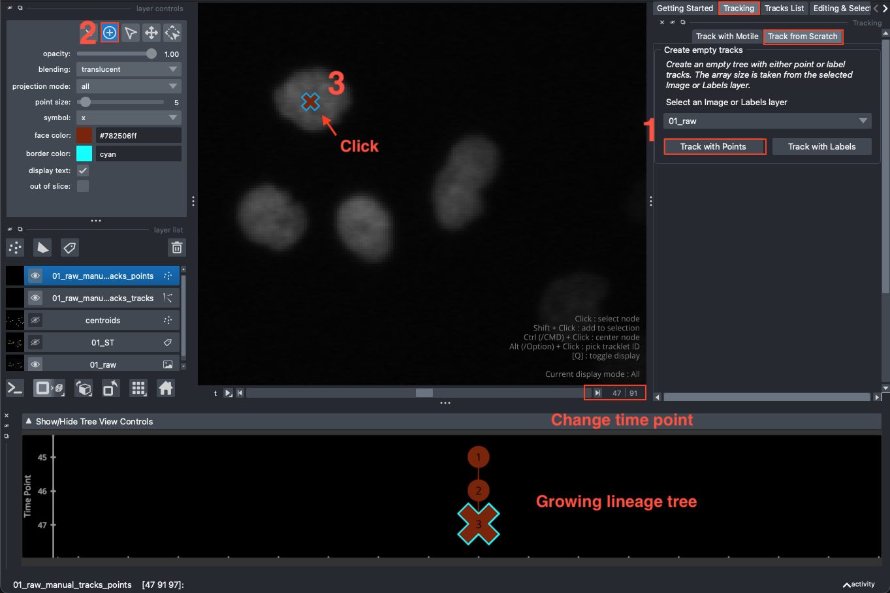
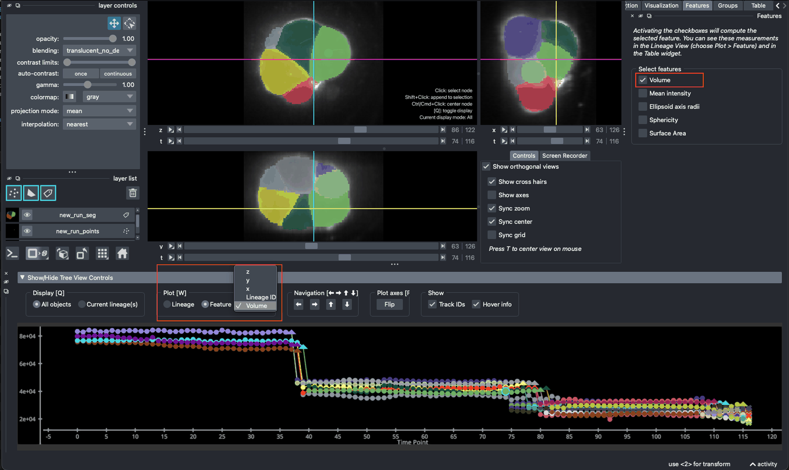

# Interactive Cell Tracking with Napari Track Edit
*September 2026 - Napari Track Edit v6.\* - Caroline Malin-Mayor - Teun Huijben - Anniek Stokkermans*

[`Napari Track Edit`](https://www.Napari-hub.org/plugins/motile-tracker) is a Napari plugin for interactive visualization, navigation, and editing of object tracking results.
You can open and edit existing tracking data, manually create new tracking results, or run automatic tracking via the Napari Track Edit integration, which offers object tracking using the [`motile`](https://funkelab.github.io/motile/) library.

This tutorial will walk you through the main functionalities.
You can find the full documentation [`here`](https://liveimagetrackingtools.org/napari-track-edit/).

Please follow the preparation instructions below before the workshop.

## Preparations

### Installation

You can install the plugin via `pypi` in the environment of you choice (e.g. `venv`, `conda`) with the command
`pip install napari-track-edit`.
Currently, this requires python >=3.11.

For example, to create a new environment with conda:

```
conda create -n napari_track_edit python=3.11
conda activate napari_track_edit
pip install napari-track-edit
pip install pyqt6
```

### Verify installation of the plugin
If your installation was successful, you should be able to find 'Napari Track Edit' under `Plugins`. Please go to `Plugins > Napari Track Edit > Open all widgets` to check if the start up screen looks like this:

<div style="display: flex; flex-wrap: nowrap; justify-content: center; align-items: flex-start; gap: 20px; margin: 20px 0; break-inside: avoid; page-break-inside: avoid;">
    <figure style="flex: 0 1 auto; width: 430px; min-width: 0; margin: 0; text-align: center; break-inside: avoid; page-break-inside: avoid;">
        
        <figcaption style="margin-top: 6px; font-size: 0.9em;">Napari Track Edit startup screen</figcaption>
    </figure>
</div>

### Plugin layout
All plugin widgets are listed under `Plugins > Napari Track Edit`, where they can be (re)opened individually or all at once.
You can hide, close, or rearrange the widgets as you like. The `/` key toggles the visibility of all widgets at once.
You can find an overview of all mouse and keyboard bindings at the end of this document.

### Downloading sample data
Two sample datasets are provided with the plugin:
- Fluo-N2DL-HeLa is a 2D dataset of images and segmentations of HeLa cells from the [`cell tracking challenge`](https://celltrackingchallenge.net/2d-datasets/).
- Mouse Embryo Membrane is a 3D dataset of images and segmentations of a membrane labeled developing early mouse embryo (4-26 cells)
from [`Fabrèges et al (2024)`](https://www.science.org/doi/10.1126/science.adh1145) available [`here`](https://zenodo.org/records/13903500).

To download and open the sample data, click `File > Open Sample > Napari Track Edit > Fluo-N2DL-HeLa (2D)` and `File > Open Sample > Napari Track Edit > Mouse Embryo Membranes (3D)`.
This may take a few minutes. After downloading, the data will remain available in the plugin for re-use.

If you see these images after opening the sample data, you are ready to start the workshop!

<div style="display: flex; flex-wrap: nowrap; justify-content: center; align-items: flex-start; gap: 20px; margin: 20px 0; break-inside: avoid; page-break-inside: avoid;">
    <figure style="flex: 0 1 auto; width: 320px; min-width: 0; margin: 0; text-align: center; break-inside: avoid; page-break-inside: avoid;">
        
        <figcaption style="margin-top: 6px; font-size: 0.9em;">Fluo-N2DL-HeLa (2D)</figcaption>
    </figure>
    <figure style="flex: 0 1 auto; width: 320px; min-width: 0; margin: 0; text-align: center; break-inside: avoid; page-break-inside: avoid;">
        
        <figcaption style="margin-top: 6px; font-size: 0.9em;">Mouse Embryo Membranes (3D)</figcaption>
    </figure>
</div>

## Inspecting a tracking result
To get familiar with the tool, it is easiest to look at an example first. Go to `Plugins > Napari Track Edit > Getting Started`, and click on one of the two examples: Hela cells (2D) or Mouse embryo (3D) at the bottom of the widget.

### Track visualization
Tracking results are displayed with:
- a **Points** layer, with nodes color-coded by tracklet ID and with symbols matching the state of the node:
  - △ dividing node
  - ✕ end point node
  - ◯ linear node
- an optional **Segmentation** (Labels) layer, with label values matching node ids, but color-coded by tracklet ID
- a **Tracks** layer, with tracks color-coded by tracklet ID
- a **Lineage View**, available from `Plugins > Napari Track Edit > Widget - Lineage View`, with nodes and edges color-coded by tracklet ID and with symbols matching the state of nodes.
- a **Table View**, available from `Plugins > Napari Track Edit > Widget - Table`, with all object properties.

<div style="display: flex; flex-wrap: nowrap; justify-content: center; align-items: flex-start; gap: 20px; margin: 20px 0; break-inside: avoid; page-break-inside: avoid;">
    <figure style="flex: 0 1 auto; width: 320px; min-width: 0; margin: 0; text-align: center; break-inside: avoid; page-break-inside: avoid;">
        
        <figcaption style="margin-top: 6px; font-size: 0.9em;">Viewing a 2D + time tracking result</figcaption>
    </figure>
    <figure style="flex: 0 1 auto; width: 320px; min-width: 0; margin: 0; text-align: center; break-inside: avoid; page-break-inside: avoid;">
        
        <figcaption style="margin-top: 6px; font-size: 0.9em;">Viewing a 3D + time tracking result with orthogonal views enabled</figcaption>
    </figure>
</div>

### Selecting nodes
You can select one or multiple nodes for closer inspection. Selection of nodes is possible in the Points and Labels layers, in the Lineage View, and in the Table view. Selecting a single node  highlights it and centers the object if it is outside the viewing range. You can append (or subtract) nodes to (from) the selection by pressing `SHIFT` when clicking.
You can restrict the display to the lineages of selected nodes in the Viewer (via the `Visualization` tab) and in the `Lineage View` (via the Lineage View controls).

<div style="display: flex; flex-wrap: nowrap; justify-content: center; align-items: flex-start; gap: 20px; margin: 20px 0; break-inside: avoid; page-break-inside: avoid;">
    <figure style="flex: 0 1 auto; width: 320px; min-width: 0; margin: 0; text-align: center; break-inside: avoid; page-break-inside: avoid;">
        
        <figcaption style="margin-top: 6px; font-size: 0.9em;">Display all objects</figcaption>
    </figure>
    <figure style="flex: 0 1 auto; width: 320px; min-width: 0; margin: 0; text-align: center; break-inside: avoid; page-break-inside: avoid;">
        
        <figcaption style="margin-top: 6px; font-size: 0.9em;">Display the lineages that have at least one selected node</figcaption>
    </figure>
</div>

<div style="background-color: #e6f7ff; border: 2px solid #104982; padding: 15px; border-radius: 10px; margin: 20px 0; break-inside: avoid; page-break-inside: avoid; -webkit-print-color-adjust: exact; print-color-adjust: exact;">
  <h2>Exercise 1 - View and explore a tracking result</h2>
  <p>1. Go to the <code>Getting Started</code> widget and open one of the two examples. Also open the <code>Lineage View</code> and <code>Table</code> widgets.</p>
  <p>2. Inspect the tracks in the Napari <code>Viewer</code>, the <code>Lineage View</code>, and in the <code>Table</code> widget. You can click in any of these views to select and center nodes and use scroll to zoom in to specific regions. Use right-mouse click to reset the Lineage View.</p>
  <p>3. Try selecting multiple nodes with <code>SHIFT+CLICK</code> or <code>SHIFT+DRAG</code> (in the Lineage View and Points layer, with the 'select points'-tool active). </p>
  <p>4. Open the <code>Editing & Selection</code> widget and look at the 'Selection' section. Test the buttons and keyboard shortcuts to clear, restore, and cycle through selections.</p>
  <p>5. Hover over nodes in the <code>Lineage View</code> and inspect the information you can read there. What is the difference between a Track and a Lineage?</p>
  <p>6. Open the <code>Visualization</code> tab and switch the Display Mode to 'Lineage'. What happens to the labels? Try the different sliders for 'highlight', 'foreground', and 'background' opacity, do you understand what they each refer to? What happens if you set the 'contour' value to 1 in the layer controls (top left menu)?</p>
  <p>7. Open the <code>Lineage View</code> controls and set the display mode to 'Current lineage(s)', and change your selection by clicking on different nodes in the <code>Viewer</code>. Try out the arrow buttons or arrow keys to move up or down the tree or to jump to neighboring nodes. </p>
  <p>8. If you had loaded the 3D example, go back to the <code>Visualization</code> widget, and activate the orthogonal views. Try out the settings in the OrthoView control widget. Press <code>T</code> to center all views on your mouse cursor. You can also do this for the 2D example, but you will see the time axis in the ortho views instead.</p>
</div>


## Generating Tracks
There are two ways to obtain a new tracking result from within the plugin: manual tracking on an image layer, or automatic tracking using Motile on a Labels or Points layer. We will explore both methods here.

### Manual tracking
Manual tracking from scratch requires that you open an `Image` layer first. In the `Tracking` widget, under `Track from Scratch` you can select this layer, and choose to either `Track with Points` or `Track with Labels`. Depending on your choice, this will create either an empty `Points` or empty `Labels` layer, where you can manually add points or paint labels to track objects.

<div style="display: flex; flex-wrap: nowrap; justify-content: center; align-items: flex-start; gap: 20px; margin: 20px 0; break-inside: avoid; page-break-inside: avoid;">
    <figure style="flex: 0 1 auto; width: 520px; min-width: 0; margin: 0; text-align: center; break-inside: avoid; page-break-inside: avoid;">
        
        <figcaption style="margin-top: 6px; font-size: 0.9em;">Manual tracking with Points</figcaption>
    </figure>
</div>

### Tracking with Motile

<div style="display: flex; flex-wrap: nowrap; align-items: flex-start; gap: 20px; margin: 20px 0; break-inside: avoid; page-break-inside: avoid;">
    <div style="flex: 1 1 auto; min-width: 0;">
        To track objects with Motile, you need to either provide object segmentations on a Napari <code>Labels</code> layer or object detections on a <code>Points</code> layer. Tracking parameters should be specified in the <code>Tracking</code> > <code>Track with Motile</code> tab and are subdivided in hyperparameters, constant costs and attribute weights.
        Hovering over each of the parameters will display a tooltip, and more extensive information can be found in the documentation.
        Once the parameters are set, you can start the solver by clicking <code>Run Tracking</code>.
        After the solve is complete, you can find the Tracking Result in the <code>Tracks List</code> tab.
        Tracking Results will accumulate here for each set of parameters that you tried.
    </div>
    <div style="display: flex; flex-wrap: nowrap; justify-content: center; align-items: flex-start; gap: 20px; flex: 0 0 auto;">
        <figure style="flex: 0 1 auto; width: 170px; min-width: 0; margin: 0; text-align: center; break-inside: avoid; page-break-inside: avoid;">
            
            <figcaption style="margin-top: 6px; font-size: 0.9em;">Tracking parameters</figcaption>
        </figure>
        <figure style="flex: 0 1 auto; width: 170px; min-width: 0; margin: 0; text-align: center; break-inside: avoid; page-break-inside: avoid;">
            
            <figcaption style="margin-top: 6px; font-size: 0.9em;">Tracking results</figcaption>
        </figure>
    </div>
</div>

<div style="background-color: #e6f7ff; border: 2px solid #104982; padding: 15px; border-radius: 10px; margin: 20px 0; break-inside: avoid; page-break-inside: avoid; -webkit-print-color-adjust: exact; print-color-adjust: exact;">
    <h2>Exercise 2 - Generating new tracks</h2>
    <p>1. Go to the <code>Tracks List</code> tab first, and clear the example tracks by clicking on the trash can icon.
    <p>2. Go to <code>File > Open Sample > Napari Track Edit > Fluo-N2DL-HeLa crop (2D)</code> to open the 2D HeLa cell test dataset</p>
    <p>3. Hide the segmentation '01_ST' and 'centroids' layers for now, but select 01_raw and go to the <code>Tracking</code> > <code>Track from Scratch</code>. Select <code>01_raw</code> from the dropdown menu, and click <code>Track with Points</code>. A new Points layer is generated, and you should see a new element in the Results list: 01_raw_manual_tracks. Select the <code>Add points</code> tool in the top left corner of the layer controls, and click on one of the nuclei in the viewer. Go to the next time point, and click again. You should see a growing lineage tree at the bottom of your screen. What happens if you add multiple points in the same time point? Try to build three small lineages.</p>
    <p>4. To compute tracks automatically, go to the <code>Tracking</code> tab, and choose parameters for tracking. Use '01_ST' as input layer. You can consult the
    <a href="https://liveimagetrackingtools.org/napari-track-edit/motile.html" target="_blank" style="color: #0073e6; text-decoration: underline;">documentation</a> to help you decide on the different values. Click <code>Run Tracking</code> to start the computation. After the solver has finished, you should see that the Lineage View is now populated with tracks and that the cells are relabeled.</p>
    <p>5. Click <code>Back to editing</code> and test multiple combinations of parameters. Note that you can also use the Points layer 'centroids' as input. Compare the different tracking results by clicking on the different entries in the <code>Tracks List</code> widget.</p>
</div>

## Displaying object features in the Lineage View
Apart from the lineage tree, you can also view object properties in the <code>Lineage View</code>. The <code>Feature</code> widget displays a list of size, shape, and intensity features that you can activate. All activated features will appear as columns in the <code>Table</code> widget and in the 'Feature' dropdown menu in the <code>Lineage View</code> controls. To display a feature, activate the 'Feature' radio button and select a feature from the list.

<div style="display: flex; flex-wrap: nowrap; justify-content: center; align-items: flex-start; gap: 20px; margin: 20px 0; break-inside: avoid; page-break-inside: avoid;">
    <figure style="flex: 0 1 auto; width: 520px; min-width: 0; margin: 0; text-align: center; break-inside: avoid; page-break-inside: avoid;">
        
        <figcaption style="margin-top: 6px; font-size: 0.9em;">View object sizes of selected lineages</figcaption>
    </figure>
</div>

## Creating groups

<div style="display: flex; flex-wrap: nowrap; align-items: flex-start; gap: 20px; margin: 20px 0; break-inside: avoid; page-break-inside: avoid;">
    <div style="flex: 1 1 auto; min-width: 0;">
        In the <code>Groups</code> tab you can create groups of nodes that you want to store to review later, for example because these are of particular interest, need to be corrected, or belong to a specific object/cell type. You can add or remove individual nodes, entire tracks, or entire lineages. You can also select all nodes in a group or export them.
    </div>
    <figure style="flex: 0 0 auto; width: 260px; min-width: 0; margin: 0; text-align: center; break-inside: avoid; page-break-inside: avoid;">
        
        <figcaption style="margin-top: 6px; font-size: 0.9em;">Creating groups of nodes</figcaption>
    </figure>
</div>

<div style="background-color: #e6f7ff; border: 2px solid #104982; padding: 15px; border-radius: 10px; margin: 20px 0; break-inside: avoid; page-break-inside: avoid; -webkit-print-color-adjust: exact; print-color-adjust: exact;">
  <h2>Exercise 3 - Measure features and create groups</h2>
  <p>1. Open the <code>Features</code> widget and activate one or multiple features. Note that this is only possible if you are currently viewing a tracking result that has an associated <code>Labels</code> layer, because most features, like size, cannot be computed for Points. Switch to 'Feature' in the <code>Lineage View</code> controls and display a feature of your choice. You may want to switch to viewing selected lineages to make the plot less crowded.</p>
  <p>2. Verify that you can also find these measurements back in the <code>Table</code> widget. Try deactivating and activating different features and check the measurements in the table.</p>
  <p>3. Open the <code>Groups</code> widget and make a new group. Sort the <code>Table</code> widget by Area (or Volume) by clicking on the header and select the top 10 rows and add these nodes to a group. Verify that you can always go back to select the nodes in this group by clicking on the mouse pointer button.</p>
  <p>4. Create another group and test the 'edit group' buttons. Verify that you can restrict the display to the nodes in the group by changing the display mode to 'group' in the <code>Visualization</code> widget. </p>
</div>

## Editing Tracks

When inspecting a tracking result, you may notice mistakes that you want to correct by deleting, adding, or modifying nodes and/or edges. You can edit the tracks using the buttons in the <code>Editing & Selection</code> tab or their corresponding keyboard shortcuts, or by editing the Napari Points and Segmentation layers directly. To undo/redo an action, click <code>Undo</code>/<code>Redo</code> in the menu or press <code>Z</code>/ <code>R</code>. Find out more in <a href="https://funkelab.github.io/motile_Napari_plugin/editing.html"><code>documentation</code></a>.

<div style="display: flex; flex-wrap: nowrap; justify-content: center; align-items: flex-start; gap: 20px; margin: 20px 0; break-inside: avoid; page-break-inside: avoid;">
    <figure style="flex: 0 1 auto; width: 660px; min-width: 0; margin: 0; text-align: center; break-inside: avoid; page-break-inside: avoid;">
        
        <figcaption style="margin-top: 6px; font-size: 0.9em;">Node and edge editing operations</figcaption>
    </figure>
</div>

<div style="background-color: #e6f7ff; border: 2px solid #104982; padding: 15px; border-radius: 10px; margin: 20px 0; break-inside: avoid; page-break-inside: avoid; -webkit-print-color-adjust: exact; print-color-adjust: exact;">
  <h2>Exercise 4 - Editing tracks</h2>
  <p>1. Open the <code>Editing & Selection</code> widget.</p>
  <p>2. Select one or multiple nodes, and use the <code>Delete</code> button or press <code>D</code> to delete them. What happens if you:</p>
  <ul style="padding-left: 60px;">
  <li>delete a linear node?</li>
  <li>delete a dividing node? </li>
  <li>delete an end point node? </li>
  <li>delete one of the two children of a dividing node?</li>
  </ul>
  <p>You can undo your actions by pressing <code>Z</code> or with the <code>Undo</code> button.</p>
  <p>3. Go to the Segmentation layer ('_seg') and activate the paint brush. Press <code>M</code> to select a new label. Paint a new node and observe the Lineage View. Then move to the next time point and paint with the same color again. Observe that a new track is created as you are painting. </p>
  <p>4. Select a new node and display the object size in the Lineage View. Then paint or erase part of it in the Segmentation layer. Observe how this affects the object size and the centroid location.</p>
  <p>5. Select two connected nodes and use the <code>Break</code> button or press <code>B</code> to break the connection. What happens to the two fragments?</p>
  <p>6. Select two nodes and try to create an edge between them with the <code>Connect</code> button or by pressing <code>C</code>. Try to answer these questions: </p>
    <ul style="padding-left: 60px;">
    <li> Can you connect any two nodes? </li>
    <li> What happens if there is a time gap between the two nodes? </li>
    <li> Can you connect more than two nodes in one go? </li>
    <li> What happens if you connect to a node that already has an outgoing edge to another node? </li>
    <li> What happens if the node your are connecting to already has an incoming edge? </li>
  </ul>
  <p>7. Select two nodes in the same time point in the Napari Viewer, and press <code>S</code> to swap the predecessors of those nodes, assigning them to each other's tracklet IDs. Does the tree view change?</p>
  <p>8. Select two nodes in the same time point, and press <code>H</code> to merge them into one node with the Tracklet ID of your choice.</p>
  <p>9. Select a trio of nodes: two at the same time point and one at the time point before, and press <code>Y</code> to set a division here. Press <code>Y</code> again to break the division.</p>
</div>

<div style="break-inside: avoid; page-break-inside: avoid;">
<h2>Saving and reopening Tracks</h2>

<div style="display: flex; flex-wrap: nowrap; align-items: flex-start; gap: 20px; margin: 20px 0; break-inside: avoid; page-break-inside: avoid;">
    <div style="flex: 1 1 auto; min-width: 0;">
        You can save your tracking results in the <code>Tracks List</code> tab. This will save the parameters and the tracking data to the displayed destination. You can load your results back in at the bottom of the <code>Tracks List</code> tab by loading a Motile Run and selecting the folder. In addition, Napari Track Edit allows you to import and export the results from/to <code>csv</code> and <code><a href="https://github.com/live-image-tracking-tools/geff">geff</code></a> via the dropdown menu at the bottom and the export (middle) button in the Results List.
    </div>
    <figure style="flex: 0 0 auto; width: 200px; min-width: 0; margin: 0; text-align: center; break-inside: avoid; page-break-inside: avoid;">
        
    </figure>
</div>
</div>

<div style="background-color: #e6f7ff; border: 2px solid #104982; padding: 15px; border-radius: 10px; margin: 20px 0; break-inside: avoid; page-break-inside: avoid; -webkit-print-color-adjust: exact; print-color-adjust: exact;">
  <h2>Exercise 5 - Save and load tracking results</h2>
  <p>1. Go to the <code>Tracks List</code> tab.</p>
  <p>2. Select a save directory on your computer via the <code>Browse</code> button, and click the save button to save the tracks.</p>
  <p>3. Click the trash can icon to delete the tracks from the list.</p>
  <p>4. At the bottom of the <code>Tracks List</code> tab, choose <code>Motile Run</code> from the dropdown menu to load your saved tracks back into the plugin. </p>
  <p>5. Export your tracking results to csv with the export button in the <code>Results List</code> (next to the save and trash buttons). You will be asked whether to include saving the segmentation (as-is or relabeled by tracklet ID). </p>
  <p>7. At the bottom of the <code>Tracks List</code> tab, choose <code>External Tracks from CSV</code> from the dropdown menu to load the results back from the csv file. If you have a segmentation image, you must provide a segmentation id, which corresponds to the label value for each node in the segmentation image (if you exported with 'Relabel segmentation by Track ID', this value should be set to Tracklet ID). </p>
  <p>8. Export your tracking result to geff. Note that the segmentation data is included in the geff, so you do not need to save it separately.</p>
  <p>9. Load the geff via <code>External Tracks from geff</code>.</p>
  <p>10. Go to the <code>Groups</code> widget, and export a group to csv and inspect the file. Which nodes are included when you load it back in?</p>
</div>

<div style="display: flex; flex-direction: column; align-items: center; gap: 20px; margin: 40px 0; text-align: center; break-inside: avoid; page-break-inside: avoid;">
  <p style="font-size: 1.2em; font-weight: bold; margin: 0;">Thank you for participating in the workshop!</p>
  <figure style="width: 200px; margin: 0; break-inside: avoid; page-break-inside: avoid;">
    
  </figure>
</div>

## Mouse and keyboard bindings

### Napari viewer and layer key bindings and mouse functions

| Mouse / Key Binding | Action |
| ------------------- | ------ |
| Click on a point or label  | Select this node (center view if necessary)  |
| `SHIFT` + click on point or label  | Add this node to selection  |
| `CTRL`/`CMD` + click on point or label  | Center view on node |
| `ALT`/`OPTION` + click on point or label  | Use this node's Tracklet ID as the current one (like the pipette, but without changing selection or time point) |
| Mouse drag with point layer selection tool active  | Select multiple nodes at once   |
| `Q` | Toggle between viewing all nodes in the points/labels or only those for the currently selected lineages or groups  |
| `T` | Center orthogonal views to mouse cursor location.
| `/` | Show/hide all widgets.

### Lineage view key and mouse functions
*********************************
| Mouse / Key Binding | Action |
| ------------------- | ------ |
| Click on a point or label | Select this node (center view if necessary) |
| `SHIFT` + click on node | Add this node to selection |
| `CTRL`/`CMD` + click on node  | Center view on node |
| `ALT`/`OPTION` + click on node  | Use this node's Tracklet ID as the current one (like the pipette, but without changing selection or time point) |
| Scroll | Zoom in or out
| Scroll + `X` / Right mouse click + drag horizontally | Restrict zoom to the x-axis of the Lineage View |
| Scroll + `Y` / Right mouse click + drag vertically | Restrict zoom to the y-axis of the Lineage View |
| Mouse drag | Pan |
| `SHIFT` + Mouse drag | Rectangular selection of nodes |
| `ESC` | Clear selection |
| `E` | Restore selection |
| `P` / Mouse button 4 (Back) | Go to previous selection in history (if present)
| `N` / Mouse button 5 (Next)| Go to next selection in history (if present)
| `Q` | Switch between viewing all lineages (vertically) or the currently selected lineages (horizontally) |
| `W` | Switch between plotting the lineage tree and the object size |
| `F` | Flip plot axes |
| Left arrow | Select the node to the left |
| Right arrow | Select the node to the right |
| Up arrow | Select the parent node (vertical view of all lineages) or the next adjacent lineage (horizontal view of selected lineage) |
| Down arrow | Select the child node (vertical view of all lineages) or the previous adjacent lineage (horizontal view of selected lineage) |


### Key bindings for editing tracks
*********************************
| Mouse / Key Binding | Action |
| ------------------- | ------ |
| `M` | Start new track |
| `D` / `Delete`   | Delete selected nodes   |
| `C` | Connect selected nodes |
| `SHIFT` + `C` | Connect selected nodes linearly (no divisions) |
| `B` | Break all existing edges in the current node selection
| `Y`  | Set a divison for a trio of selected nodes  |
| `H`  | Merge horizontal node pairs (nodes that are on the same time point)  |
| `S`  | Swap the predecessors of two nodes at the same time point, if possible  |
| `Z`  | Undo last editing action |
| `R`  | Redo last editing action |
