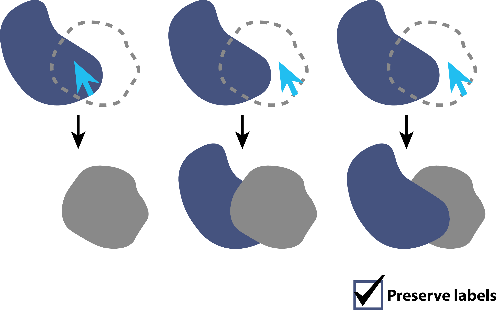

Editing Tracks
==============

Usage Overview
**************
Predicted tracks can be corrected by deleting, adding, or modifying nodes and/or edges, using the buttons in the 'Editing & Selection' widget or their corresponding keyboard shortcuts, or by editing the napari Points and Segmentation layers directly.

Editing nodes
*************

.. _delete-node:

Deleting nodes
---------------
Nodes can be deleted by selecting one or multiple nodes and clicking the 'Delete' button in the Editing & Selection menu or pressing ``D`` or ``Delete`` on the keyboard.
Deletion of a node results in its removal from the tree view and removal of its corresponding point and segmentation label in the Points and Segmentation napari layers.
If the node was connected to a predecessor and a successor, a new skip edge will be formed between the predecessor and successor nodes, leaving the remaining track intact.
If one of the two children of a dividing node is deleted, the nodes of the remaining sibling are relabeled to match the track ID of the parent.

.. figure:: images/delete_node.png
   :width: 600px
   :align: center

   Examples of deleting nodes. Deletion of a node in a linear track will create a skip edge (top), whereas deletion of one of the two children (green) of a dividing node will relabel the nodes of the remaining sibling (yellow), which is now part of the parent track (grey) (bottom).

.. _add-node:

Adding nodes
-------------
New nodes can be added in two ways, depending on what type of detections you used as input:
    - By painting on the Segmentation layer, if it exists. To continue an existing track, select a node in the track and scroll to a new time frame. The label ID will automatically be updated to create a new node using the same track ID. To start a new track, press "m" to generate a new label with a new track ID.

    - By adding a new point in the Points layer, if there are only point detections. A new, non-connected endpoint node will be created at the clicked position.

.. figure:: images/add_node.png
   :width: 600px
   :align: center

   Add a new node by painting. Press ``M`` on the segmentation layer to select a new label color and track ID for painting.

Updating nodes
---------------
Node attributes (e.g. size, position) can be updated in two ways:
    - If the source layer for tracking was a Points layer and no segmentation was provided, the points can be repositioned by clicking the 'Select points' button in the Points layer menu and clicking and dragging points to their new location.
    - If a segmentation layer was provided, node position is determined by the centroid location of each label. Therefore, nodes cannot be repositioned by moving their corresponding points in the Points layer. Instead, nodes can be updated by painting and/or erasing their labels in the Segmentation layer, which will automatically update their position and size properties.

Editing edges
*************

Deleting edges
----------------
Edges can be deleted by selecting two connected nodes and clicking the 'Break' button in the Edit Tracks menu or by pressing ``B`` on the keyboard. In a linear track, deleting an edge will split the track in two fragments. The first fragment will retain the track ID of the source node,
while a new track ID is assigned to the fragment of the target node.

.. figure:: images/break_edge.png
   :width: 600px
   :align: center

   Examples of breaking edges. In a linear track, breaking an edge will relabel the fragment of the target node (top). If an edge between a dividing node and one of its children is deleted, both fragments maintain their track ID but the remaining sibling (magenta) is relabeled since it is now part of the same track as the parent (cyan) (bottom).

Adding an edge
--------------
New edges can be added by selecting two non-horizontal nodes and clicking on the 'Add' button in the Edit Tracks menu or by pressing ``A`` on the keyboard. If the target node already has an incoming edge, the user will be prompted with the question whether the existing edge can be broken,
since a node in a lineage tree cannot have two incoming edges. Note that new edges are also added automatically in certain cases when a node is being added or removed (see :ref:`delete-node` and :ref:`add-node`).

.. figure:: images/add_edge.png
   :width: 600px
   :align: center

   Adding an edge between two nodes, creating a new division point.

Swapping nodes
--------------
The incoming edges of two nodes at the same time point can be swapped with the 'Swap' button (``S`` key). This essentially breaks two incoming edges and creates two new ones in one action.

.. figure:: images/swap_edges.png
   :width: 600px
   :align: center

   Swapping the incoming edges between two nodes at the same time point.

Undoing and redoing actions
***************************
All types of actions described above are appended to the Action History, and can be undone or redone. To undo, click 'Undo' in the Edit Tracks menu or by pressing ``Z``. Similarly, to redo an action, press 'Redo' in the Edit Tracks menu or ``R``.

Copying nodes from an external source
*************************************
Apart from adding new nodes by adding points or segmentation labels, it is also possible to copy nodes from points or labels on another napari layer.
The ``Copy from source`` tab in the ``Editing & Selection`` widget allows you to pick a source layer (either Points or Labels).
Once connected, right-clicking while the target layer (either the tracking Points ('_points') or Labels layer ('_seg')) is active, allows you to copy the underlying source node to the target layer.
The copied node will have the currently active tracklet ID, unless the ``Copy as new track`` checkbox is activated, in which case a copy will start a new track.
For Labels layers, a copy event outcome depends on the target layer's label at the clicked location:

- If the target layer had no label (only background) at the clicked location, all source label pixels will be copied to the target, overwriting the background and any other values in that region.
- If the target layer had a label at the clicked location, that label will first be removed entirely (also outside the source label region), and then the source label will be copied to the target.

The target layer can be protected from being overwritten by a copy event by activating the ``preserve labels`` option. When active, any non-zero, non-active tracklet ID target label pixels that overlap with the source label will be preserved, and only the source label pixels that do not overlap with these pixels will be copied.

