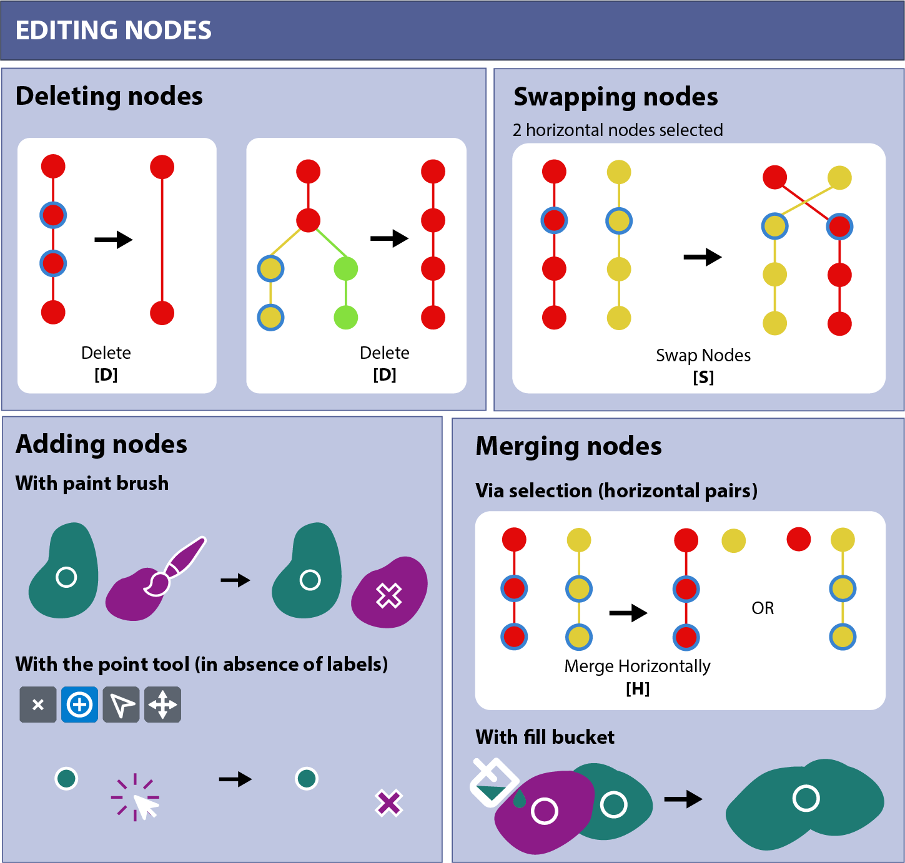
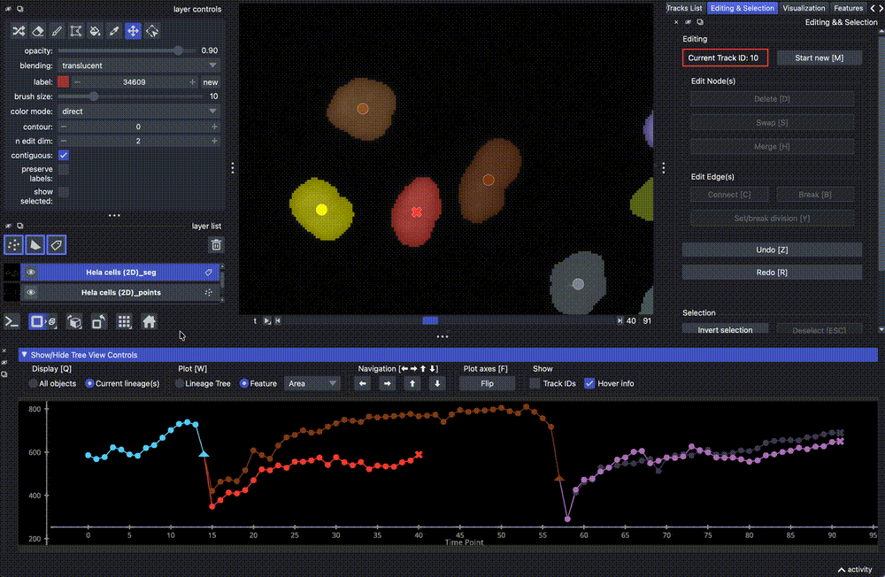
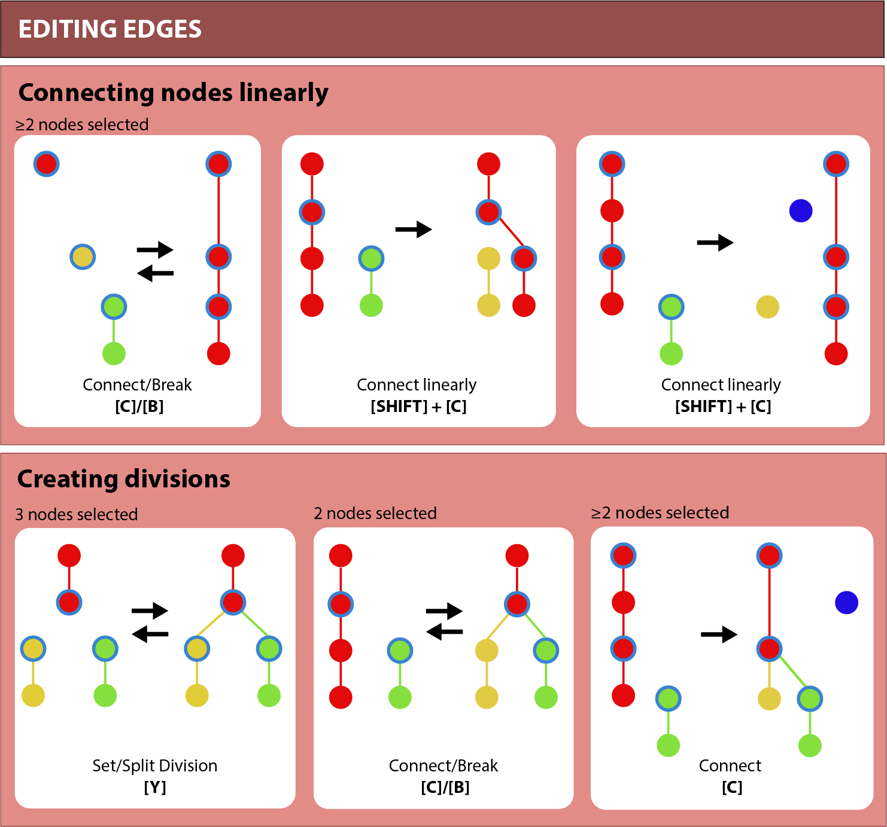
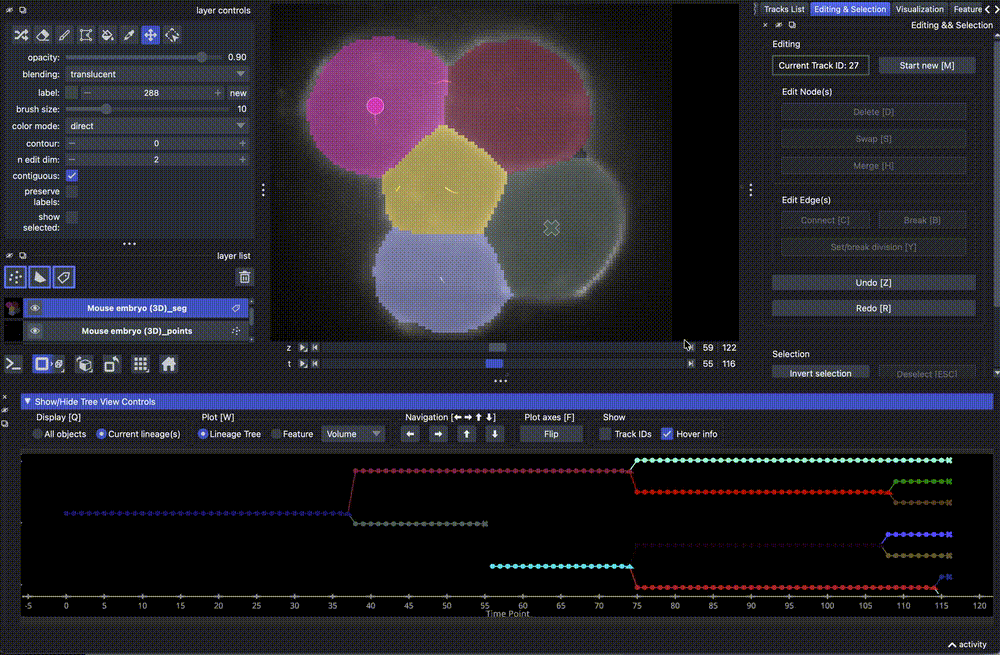
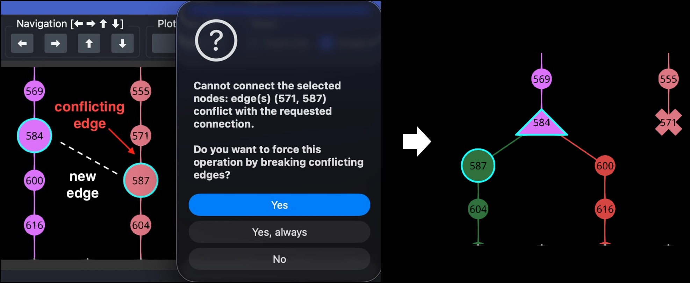

Editing tracks
==============

When inspecting a tracking result, you may notice mistakes that you want to correct.
Tracks can be corrected by deleting, adding, or modifying nodes and/or edges, using the
buttons in the ``Editing & Selection`` widget or their corresponding keyboard shortcuts,
or by editing the napari Points and Segmentation layers directly. Most editing actions
act on the currently selected nodes, see :ref:`selecting-nodes`.

The ``Editing`` section of the ``Editing & Selection`` widget contains:

- The ``Current Track ID``, shown in the color of that tracklet. This is the tracklet ID
  that new nodes will get. Selecting a node or ``ALT/OPTION + click`` on a node makes its
  tracklet ID the current one.
- ``Start new [M]``: generate a new tracklet ID (and a new segmentation label, if the
  tracks have a segmentation) to start a new track.
- ``Edit Node(s)``: ``Delete [D]``, ``Swap [S]``, and ``Merge [H]``.
- ``Edit Edge(s)``: ``Connect [C]``, ``Break [B]``, and ``Set/break division [Y]``.
- ``Undo [Z]`` and ``Redo [R]``.

Buttons are only enabled if the number of selected nodes is valid for that action.

Editing nodes
*************

   Overview of the node editing operations. Selected nodes are shown with a blue outline.

.. _delete-node:

Deleting nodes
--------------
Nodes can be deleted by selecting one or multiple nodes and clicking the ``Delete``
button or pressing ``D`` or ``Delete`` on the keyboard.
Deletion of a node results in its removal from the tree view and removal of its
corresponding point and segmentation label in the Points and Segmentation napari layers.
If the node was connected to a predecessor and a successor, a new skip edge will be formed
between the predecessor and successor nodes, leaving the remaining track intact.
If one of the two children of a dividing node is deleted, the nodes of the remaining
sibling are relabeled to match the track ID of the parent, since the parent no longer
divides.

Nodes can also be deleted by erasing their label entirely in the Segmentation layer,
or by deleting points in the Points layer.

.. _add-node:

Adding nodes
------------
New nodes can be added in two ways, depending on what type of detections you have:

- By painting on the Segmentation layer, if it exists. To continue an existing track,
  select a node in the track and scroll to a new time frame. The label ID will
  automatically be updated to create a new node using the same track ID. To start a new
  track, press ``M`` to generate a new label with a new track ID.
- By adding a new point with the ``Add points`` tool in the Points layer, if there is no
  segmentation. The new node gets the current track ID, just like when painting.

A new node is inserted into the track with the current track ID: it is connected to the
nearest earlier and/or later node of that track, and an existing edge between those two
nodes is replaced by edges to and from the new node. If the track already has a node at
the current time point, a new track is started with a new track ID instead. If the new
node would be added to a track after it has divided, you are asked whether the
conflicting division edges may be broken.

Painting across multiple time points at once (e.g. in a view where time is one of the
displayed axes) is not supported.

Updating nodes
--------------
Node attributes (e.g. size, position) can be updated in two ways:

- If there is no segmentation, the points can be repositioned by activating the
  'Select points' tool in the Points layer controls and clicking and dragging points to
  their new location.
- If there is a segmentation, node position is determined by the centroid location of
  each label. Therefore, nodes cannot be repositioned by moving their corresponding points
  in the Points layer. Instead, nodes can be updated by painting and/or erasing their
  labels in the Segmentation layer, which will automatically update their position and
  any measured :doc:`features <features>`.

   Example of how to add and update a node. Painting with the current tracklet ID extends
   the track by a new node. You can continue painting with the same label value to update
   the node segmentation.

Swapping nodes
--------------
The incoming edges of two nodes at the same time point can be swapped with the ``Swap``
button (``S`` key). This essentially breaks two incoming edges and creates two new ones in
one action, so that each node continues the track of the other node's predecessor.

.. figure:: images/swap_edges.png
   :width: 700px
   :align: center

   Swapping two nodes.

Merging nodes
-------------
Nodes that share a time point can be merged into a single node with the ``Merge`` button
(``H`` key). This is useful to correct over-segmentation, and requires a segmentation.
Any number of nodes can be merged at once, and if the selection contains nodes in more
than one time point, every set of nodes sharing a time point is merged.
For each set, you are asked which of the tracklet IDs the merged node should keep
(one pop up is shown per distinct set of tracklet IDs). The labels of the other nodes are
added to the node with the chosen tracklet ID, and the other nodes are deleted, so that
the merged node keeps the edges of the chosen node.
Selected nodes that are alone in their time point are left untouched.

You can also merge two labels manually with the fill bucket tool of the Segmentation layer:
select the label of the node you want to keep (for example with ``ALT/OPTION + click``,
or the pipette tool) and fill the other label with it.

Editing edges
*************

   Overview of the edge editing operations. Selected nodes are shown with a blue outline.

Breaking edges
--------------
Select two or more connected nodes and click the ``Break`` button, or press ``B``.
All edges between the selected nodes are broken (including skip edges), splitting the
selection into separate track fragments that each receive their own tracklet ID. Edges to
nodes outside of the selection are kept. Breaking is the inverse of connecting.
If an edge between a dividing node and one of its children is broken, the remaining
sibling becomes part of the same track as the parent, and is relabeled accordingly.

Connecting nodes
----------------
Select two or more nodes and click the ``Connect`` button, or press ``C`` on the keyboard.
The selected nodes are sorted by time and connected pairwise, so that they form a single
track. The nodes do not have to be in consecutive time points: skip edges spanning one or
more time points are allowed. Pairs that are already connected are left alone, so a
partly connected selection is completed rather than rebuilt.
The tracklet ID of the first (earliest) node is assigned to all of the connected nodes,
unless the connection creates a division (see below).

Selecting two or more nodes that are in the same time point is never valid, and cannot be
forced: a warning is shown explaining that at most one node per time point may be selected.

Note that new edges are also added automatically in certain cases when a node is being
added or removed (see :ref:`delete-node` and :ref:`add-node`).

   Example of how to make a new edge between two disconnected nodes. Select both nodes with
   shift+click and connect them via the ``Connect`` button. The connection can be broken
   again with the ``Break`` button. The ``Undo`` button undoes the last action.

Connecting with or without divisions
~~~~~~~~~~~~~~~~~~~~~~~~~~~~~~~~~~~~
If a node in the selection already has exactly one child, there are two sensible things
to do, and which one you want is asked when you use the button:

- **With divisions** (``C``): the existing child edge is kept and the new edge turns that
  node into a division point. The existing child is relabeled with a new tracklet ID, and
  the newly connected node keeps its own tracklet ID within the lineage of the parent.
- **Linear** (``SHIFT`` + ``C``): the existing child edge is treated as a conflict too, so
  that the selection becomes one linear track without divisions. Outgoing edges of the
  last node of the selection are never touched, since that node does not get a new child.

The question is only asked when the two modes would actually give a different result,
and it is skipped entirely when you use the keyboard shortcuts, which pick a mode directly.

Conflicting edges
~~~~~~~~~~~~~~~~~
Connecting nodes can conflict with edges that already exist: the target node may already
have an incoming edge (a node in a lineage tree cannot have two parents), or the source
node may already have two children, so that the new edge would create a three-way
division. In both cases the user is prompted with the question whether the conflicting
edges may be broken. If the answer is no, nothing is changed at all.

   Example of an edge conflict: node 587 already has an incoming edge, and can thus not
   gain a new incoming edge without breaking the existing one. The dialog asks whether you
   want to force the operation this way. If accepted, node 571 becomes a new endpoint, and
   a division is created because node 584 already had an outgoing edge (if connecting
   linearly, this edge would have been broken too).

Setting and breaking divisions
------------------------------
Select three nodes, one parent and two children in a later time point, and click the
``Set/break division`` button, or press ``Y``, to connect them as a division. Any
conflicting edges (other outgoing edges of the parent, and other incoming edges of the
children) are broken first. If the three nodes already form a division, pressing ``Y``
breaks it again: the parent is left as a track end point, and both children become the
start of a new track.

Undoing and redoing actions
***************************
All types of actions described above, including painting and erasing in the Segmentation
layer, are appended to the Action History, and can be undone or redone.
To undo, click ``Undo`` or press ``Z``. Similarly, to redo an action, click ``Redo`` or
press ``R``. Note that the action history is not saved: after loading tracks from disk,
the history starts empty.
