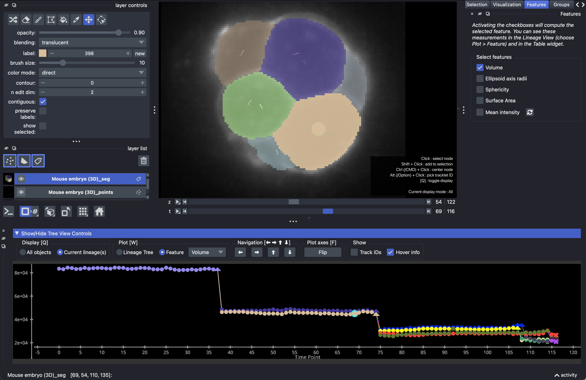

Measuring and displaying features
=================================

Apart from the lineage tree, you can also view object properties, such as size,
shape, and intensity, in the ``Lineage View`` and in the ``Table`` widget.

Measuring features
******************
If your tracks have a segmentation, you can select size, shape, and intensity
features to measure in the ``Features`` widget
(``Plugins`` > ``Napari Track Edit`` > ``Widget - Features``). Activating a checkbox computes
the feature for all nodes, and deactivating it removes the measurement again.
The available features are:

- ``Area`` (2D) or ``Volume`` (3D), in calibrated units.
- ``Ellipse axis radii`` (2D) or ``Ellipsoid axis radii`` (3D).
- ``Circularity`` (2D) or ``Sphericity`` (3D).
- ``Perimeter`` (2D) or ``Surface Area`` (3D).
- ``Mean intensity``: the mean intensity of each object in one or more image layers.
  When you activate it, a dialog asks which image layers to measure. Only image layers
  with the same shape as the segmentation can be selected; if you have multichannel data,
  please split the stack into the different channels first. Use the refresh button next
  to the checkbox to change which layers are measured.

Features are measured in calibrated units, so make sure that your layers have the correct
scale before starting the tracking. Feature measurements are only supported if you are
using a segmentation layer, since most features, like size, cannot be computed for
points.

Measured features are kept up to date while you :doc:`edit <editing>`: painting or
erasing part of a label updates the measurements of that node.

Displaying features in the Lineage View
***************************************
All activated features appear in the ``Feature`` dropdown menu in the ``Plot [W]``
section of the Lineage View controls. To display a feature, activate the ``Feature``
radio button (or press ``W`` in the Lineage View) and select a feature from the list.
The Lineage View then plots the feature value of each node over time, instead of the
lineage tree. Selecting, centering, and navigating nodes works the same as in the tree plot.

It is often useful to combine this with the ``Current lineage(s)`` display mode
(see :ref:`display-modes`), to make the plot less crowded.

   View object sizes of selected lineages.

Displaying features in the Table
********************************
All activated features also appear as columns in the ``Table`` widget
(see :ref:`table-view`). Click on a column header to sort the table by that feature, for
example to find the largest or smallest objects.
