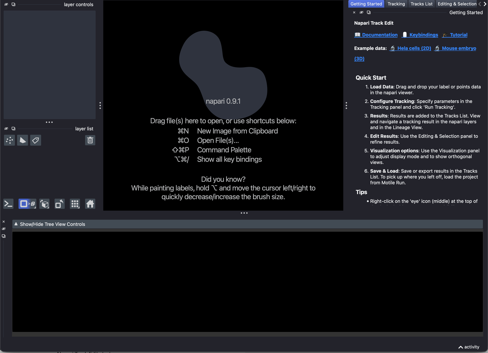
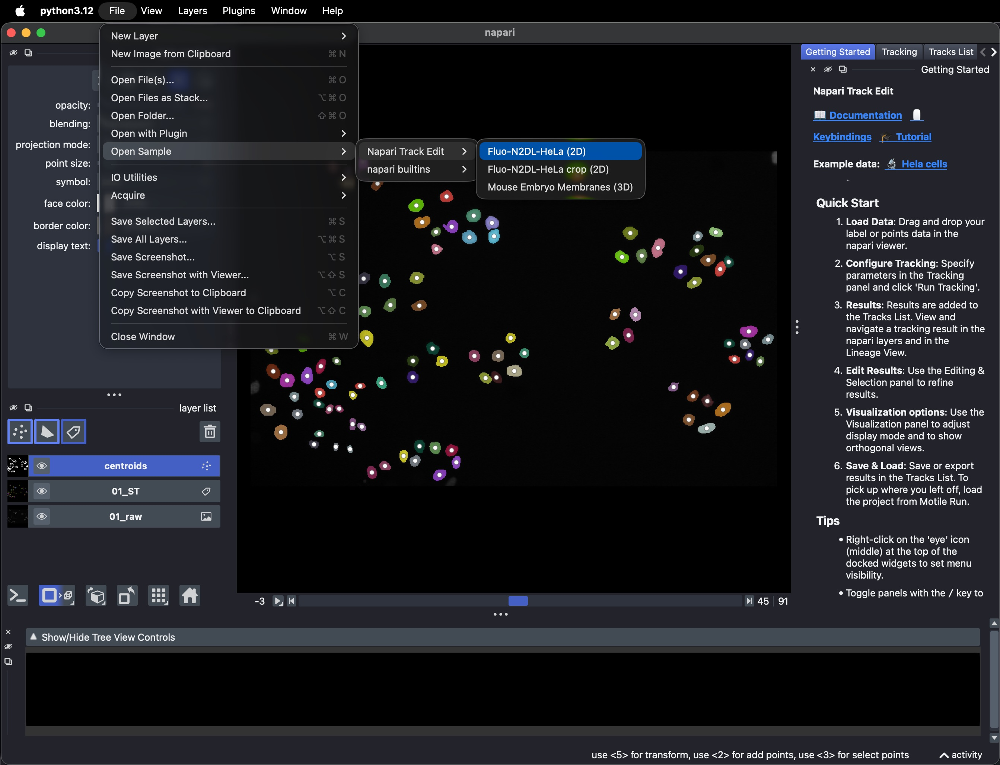
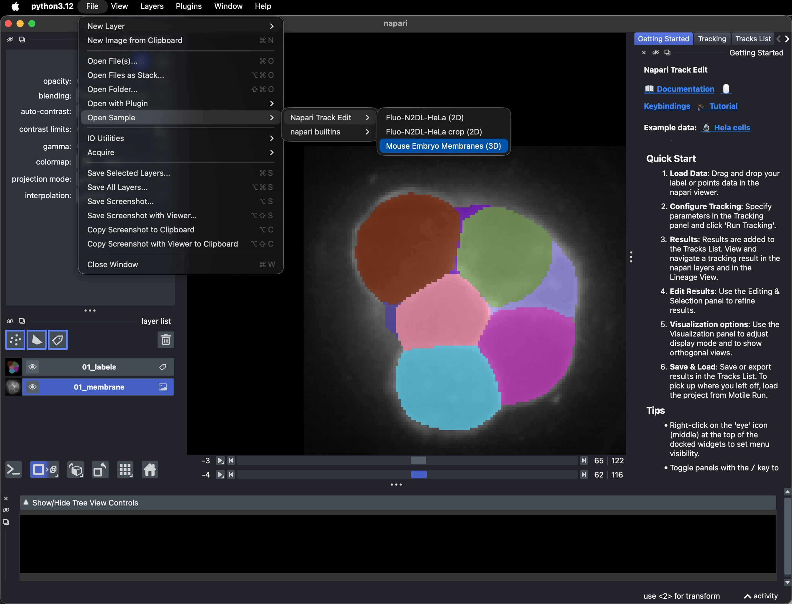

Getting started
===============

Installation
************
Install from PyPI in the environment of your choice (e.g. ``venv``, ``conda``)::

    pip install napari-track-edit

Currently, napari-track-edit requires Python >=3.11. For example, to create a new
environment with conda::

    conda create -n napari_track_edit python=3.11
    conda activate napari_track_edit
    pip install napari-track-edit
    pip install pyqt6

Recommended extras
------------------
For better performance, you can install optional extras:

- **numba**: Speeds up candidate graph construction significantly.::

    pip install napari-track-edit[numba]

- **gurobi**: Uses the Gurobi solver instead of the default open-source solver.
  Gurobi is much faster but requires a license (free for academics).::

    pip install napari-track-edit[gurobi]

You can install multiple extras at once: ``pip install napari-track-edit[numba,gurobi]``

Gurobi license version mismatch
-------------------------------
If you have a Gurobi license and encounter an error about license version mismatch,
you may need to install a specific version of ``gurobipy`` that matches your license.
Use one of the version-specific extras::

    pip install napari-track-edit[gurobi12]  # For Gurobi 12.x licenses
    pip install napari-track-edit[gurobi13]  # For Gurobi 13.x licenses

If the installation is successful, you can then run ``napari`` from your command line, and
Napari Track Edit should be visible in the ``Plugins`` drop down menu.
Clicking ``Open all widgets`` should open the menu widgets on the right of the viewer,
and a lineage tree view in the bottom of the viewer. It is normal that it takes a
minute to load if this is the very first time you start napari-track-edit in a new napari
environment.

   Napari Track Edit startup screen.

Plugin layout
*************
Napari Track Edit comes with several widgets for tracking, viewing, and editing.
All widgets are listed under ``Plugins`` > ``Napari Track Edit``, where you can open
them all at once via ``Open all widgets``, or (re)open them individually:

- ``Getting started``: links to the documentation and tutorial, and the example tracks.
- ``Tracking``: create new tracks, :doc:`automatically or manually <tracking>`.
- ``Tracks List``: all tracks currently in memory, and :doc:`saving, loading, importing and exporting <saving_loading>` them.
- ``Editing & Selection``: :doc:`edit tracks <editing>` and navigate the :ref:`node selection <selecting-nodes>`.
- ``Visualization``: :ref:`display options <visualization-widget>` for the napari layers.
- ``Features``: :doc:`measure object features <features>`.
- ``Groups``: :doc:`create groups of nodes <groups>`.
- ``Table``: the :ref:`table view <table-view>` of all nodes and their features.
- ``Lineage View``: the :ref:`lineage tree view <lineage-view>`.

You can optionally close or hide widgets via the close (x) button, or via right
mouse-click on the 'eye' button. Optionally, you can float individual widgets and place
them somewhere else (for example, you can move the lineage view to a secondary monitor).
If you press the ``/`` key, you can hide/show all widgets at once.
You can find an overview of all mouse and keyboard bindings on the
:doc:`key bindings <key_bindings>` page.

Example data
************
There are three example datasets provided in ``File`` > ``Open Sample`` > ``Napari Track Edit``:

- ``Fluo-N2DL-HeLa (2D)``: a 2D dataset of images and segmentations of HeLa cells from
  the `Cell Tracking Challenge`_, with both a Labels layer and a Points layer.
- ``Fluo-N2DL-HeLa crop (2D)``: a cropped subset of the same dataset, for testing
  features on smaller data.
- ``Mouse Embryo Membranes (3D)``: a 3D dataset of images and segmentations of a
  membrane-labeled developing early mouse embryo (4-26 cells) from
  `Fabrèges et al (2024)`_, automatically downloaded from `zenodo`_.

Downloading the data may take a few minutes. After downloading, the data remains
available in the plugin for re-use.

   Fluo-N2DL-HeLa (2D)

   Mouse Embryo Membranes (3D)

These datasets contain images and detections only. To see what a tracking result looks
like, open one of the example tracks below, or :doc:`generate your own tracks <tracking>`.

Example tracks
**************
To get familiar with the tool, it is easiest to look at an example first. Go to
``Plugins`` > ``Napari Track Edit`` > ``Widget - Getting started``, and click on one of
the two examples at the top of the widget: HeLa cells (2D) or Mouse embryo (3D).
This adds the raw images to the viewer (downloading them first if needed) and loads
a complete tracking result for them into the ``Tracks List``. The next section,
:doc:`viewing`, explains how to explore it.

Tutorial
********
If you prefer a step-by-step walkthrough with exercises, you can follow the
:doc:`tutorial <napari-track-edit_tutorial>`,
which covers most of the functionality described in this documentation.

.. _Cell Tracking Challenge: https://celltrackingchallenge.net/
.. _Fabrèges et al (2024): https://www.science.org/doi/10.1126/science.adh1145
.. _zenodo: https://zenodo.org/records/13903500
