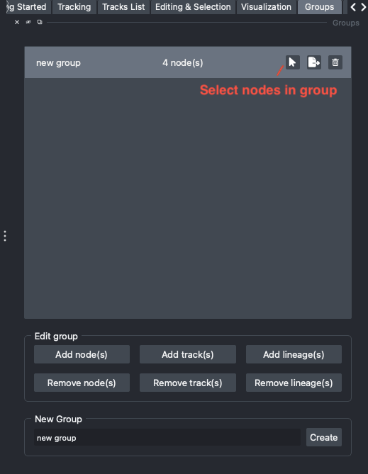

Groups
======

In the ``Groups`` widget (``Plugins`` > ``Napari Track Edit`` > ``Widget - Groups``) you
can create groups of nodes that you want to store to review later, for example because
these are of particular interest, need to be corrected, or belong to a specific
object/cell type.

   Creating groups of nodes.

Creating groups
***************
Type a name in the ``New Group`` field and click ``Create``. The new group is added to the
list of groups and selected. Each entry in the list shows the name of the group, the
number of nodes it contains, and three buttons:

- the mouse pointer button selects all nodes in the group, so that you can always go
  back to them;
- the export button exports the nodes in the group (and their ancestors) to CSV or geff
  (see :ref:`exporting-tracks`);
- the trash can button deletes the group (the nodes themselves are not deleted).

Adding and removing nodes
*************************
Select a group in the list, and use the buttons in the ``Edit group`` section to add or
remove nodes, based on the current :ref:`node selection <selecting-nodes>`:

- ``Add node(s)`` / ``Remove node(s)``: add or remove only the selected nodes.
- ``Add track(s)`` / ``Remove track(s)``: add or remove all nodes in the tracks of the
  selected nodes.
- ``Add lineage(s)`` / ``Remove lineage(s)``: add or remove all nodes in the lineages of
  the selected nodes.

A convenient way to fill a group is to sort the ``Table`` by a feature, select a range of
rows, and add those nodes to a group.

Using groups
************
- **Display**: set the ``Display Mode`` in the ``Visualization`` widget to ``Group``
  (or press ``Q`` until the mode is 'Group') to restrict the napari layers to the nodes in
  the currently selected group. See :ref:`display-modes`.
- **Color**: groups are also available in the ``Color by`` dropdown menu of the
  ``Visualization`` widget, to highlight the nodes in a group in all views.
- **Export**: exporting a group writes the nodes in that group together with all their
  ancestors, so that the exported lineages stay intact. This way you can analyze a subset
  of the tracks in other tools.

Groups are stored with the tracks, so they are kept when you
:doc:`save and load <saving_loading>` your tracks.
