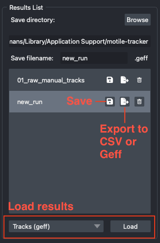

Saving, loading, importing and exporting
========================================

   Saving, exporting and loading tracks in the ``Tracks List`` widget.

.. _save-load-vs-import-export:

Saving and loading vs. importing and exporting
**********************************************
The ``Tracks List`` widget offers two different ways of getting tracks in and out
of the application, and it is worth understanding which one you want.

**Saving and loading** is for continuing your own work. The application controls the
format, so it can make and enforce assumptions about it: tracks are always written
as a `geff`_ store, with the metadata and attributes the application needs already
in place. Anything you save can be loaded back into a later session and picked up
exactly where you left off, including run-specific extras like the motile solver
parameters. Use this while you are still working on a dataset.

**Importing and exporting** is for exchanging tracks with other tools. Here the
application cannot assume much about the format, so it supports more of them (`geff`_
and CSV) and asks you to fill in the gaps - which column means what, how the data is
scaled, where the segmentation lives. An export is a snapshot for another tool to read,
not a session you can resume, and importing tracks from elsewhere requires the
column mapping step described in :ref:`importing-external-tracks`.

In short: save/load round-trips within the application, import/export crosses the
boundary to other tools.

There is a third option, described under :ref:`working-in-a-database` below, where
the tracks live in a database on disk and every edit is written there as you make
it. That removes the need to remember to save at all, at the cost of the tracks
being tied to one file on one machine.

Saving tracks
*************
Above the tracks list are a ``Save directory`` field, with a ``Browse`` button, and a
``Save filename`` field. Together these are the path that the save (floppy disk) button
beside a set of tracks writes to; the ``.geff`` suffix is added for you and shown as a
fixed label beside the filename. The directory starts out as an application-owned
location (the same place the sample data is downloaded to) and the filename follows
whichever tracks you have selected, so in the common case you can simply click save.

Both fields are editable, and your edits last for the rest of the session - so if you
point the directory somewhere else once, subsequent saves go there too. Once you have
typed your own filename it stops following the selection, so selecting different tracks
will not overwrite what you typed. Because names in the tracks list are not required to
be unique, always check the filename before saving if you have several similarly named
sets of tracks.

Saving writes to exactly the path shown; there is no timestamped subdirectory. If
something already exists at that path you will be asked to confirm before it is
replaced. Note that saving a set of tracks over an existing geff store replaces the
tracks but leaves any other files in the store alone.

Loading tracks
**************
The dropdown menu at the bottom of the widget selects what to load, and the ``Load``
button starts it:

- ``Tracks (geff)`` - load tracks previously saved from this application. Select the
  ``.geff`` store itself.
- ``SQL database`` - open a tracks database. Unlike the other options this
  does not read the tracks into memory: the database is opened in place and every
  edit is written to it. See :ref:`working-in-a-database`.
- ``Motile Run`` - load a saved motile run, which restores the solver parameters into
  the ``Run Editor`` along with the tracks. Select the ``.geff`` store the run was
  saved to. Runs saved by older versions, which used a timestamped directory
  containing the tracks and a separate parameters file, can still be loaded.
- ``External tracks from CSV`` and ``External tracks from geff`` - import tracks that
  were generated elsewhere. These open the import dialog, where you map columns to
  attributes and optionally provide a segmentation; see :ref:`importing-external-tracks`.

.. _exporting-tracks:

Exporting tracks
****************
The export button beside a set of tracks in the tracks list opens the export dialog,
where you choose ``GEFF``, ``CSV`` or ``SQL database`` and pick the location, optionally
including the segmentation as zarr or tiff. With ``Relabel segmentation by Track ID``,
the exported segmentation labels are the tracklet IDs instead of the node IDs. For geff,
the segmentation is included in the geff store, so you do not need to save it separately.

You can also export a subset of tracks from the :doc:`Groups <groups>` widget: this exports
the nodes in the group and their ancestors.

Exported tracks are meant to be read by other tools: to continue working
on them here later, save them instead, or export a database and keep editing in it.

.. _importing-external-tracks:

Importing externally generated tracks
*************************************
It is also possible to view and edit tracks that were not created in this application,
using the synchronized Lineage View and napari layers. Bringing them in is an *import*
rather than a load: because the application cannot assume anything about how another tool
wrote the data, you have to describe its layout as part of importing it.

To import, navigate to the ``Tracks List`` tab and select ``External tracks from CSV`` or
``External tracks from geff`` in the dropdown menu at the bottom of the widget, and click
``Load``. A pop up menu will allow you to select a CSV file or geff zarr folder and map its
columns to the required default attributes and optional additional attributes.
You may also provide the accompanying segmentation and specify scaling information.

The following columns have to be selected:

- time: representing the position of the object in the time dimension.
- x: x centroid coordinate of the object.
- y: y centroid coordinate of the object.
- z (optional): z centroid coordinate of the object, if it is a 3D object.
- id: unique id of the object.
- parent_id: id of the directly connected predecessor (parent) of the object. Should be
  empty if the object is at the start of a lineage.
- seg_id: label value in the segmentation image data (if provided) that corresponds to
  the object id. If you exported the segmentation with ``Relabel segmentation by Track ID``,
  this should be the tracklet ID.

Once imported, tracks appear in the tracks list like any other set of tracks, and can
be edited and then saved in the application's own format so that later sessions can load
them back without repeating the column mapping.

Adding tracks from Python
-------------------------
You can also add tracks to the viewer from a Python script. For this, you need a
`Tracks object`_, containing a graph representing the tracking result, and optionally
a segmentation. The graph is directed, with nodes representing detections and
edges going from a detection in time t to the same object in t+n (edges go forward in time).
Nodes must have an attribute representing time, by default named "t" but a different name
can be stored in the ``Tracks.time_attr`` attribute. Nodes must also have one or more attributes
representing position. The default way of storing positions on nodes is an attribute called
"pos" containing a list of position values, but dimensions can also be stored in separate attributes
(e.g. "x" and "y", each with one value). The name or list of names of the position attributes
should be specified in ``Tracks.pos_attr``.

The segmentation is expected to be a numpy array with time as the first dimension, followed
by the position dimensions in the same order as the ``Tracks.pos_attr``. The segmentation
must have unique label ids across all time points - there is a helper function in
funtracks called ``ensure_unique_labels`` that relabels a segmentation to be unique
across time if needed. If a segmentation is provided, the node ids in the graph should
match label id of the corresponding segmentation.

An example script that loads a tracks object from a CSV and segmentation array
is provided in ``scripts/view_external_tracks.py``.

Once you have a Tracks object in the format described above, the following code
will view it in the Lineage View and create synchronized napari layers (Points,
Labels, and Tracks) to visualize the provided tracks:

.. code-block:: python

    tracks_viewer = TracksViewer.get_instance(viewer)
    tracks_viewer.tracks_list.add_tracks(tracks, "example")

.. _working-in-a-database:

Working in a database
*********************
Tracks normally live in memory until you save them. They can instead live in a SQLite
database on disk, where every edit is written as you make it. This is worth doing when:

- you do not want to lose work if napari closes unexpectedly, since there is nothing
  to remember to save;
- the graph is large, because the candidate nodes the solver considered but did not
  select stay on disk rather than in memory;
- several people annotate the same tracks, for example by each taking a different
  range of timepoints.

Getting into a database
-----------------------
Importing never puts tracks in a database - CSV and geff imports always build an
in-memory copy. There are two ways in:

- **Export one.** In the export dialog choose ``SQL database``. By default the current
  tracks switch over to the file you just wrote, so editing continues there - which is
  usually why you are writing one. Switching over clears the undo history. Tick
  ``Continue editing the in-memory graph`` if you would rather write a plain copy and
  carry on as before.
- **Open one.** Choose ``SQL database`` in the load dropdown and select the
  ``.db`` file.

Exporting a copy of tracks that are *already* in a database works the other way round:
the default is to stay in the database you are in, since a copy is normally something
you are handing to someone else. Untick the box to move over to the copy instead.

When a set of tracks in the tracks list is stored in a database, the path is shown
above the list.

What a database holds
---------------------
A database holds the whole graph, including the segmentation and the candidate nodes
that the solver considered but did not select - which a geff export drops. Deleted
nodes are kept as candidates too, so a reopened database still knows about them and
they can be reconnected. Undo history is not part of the graph and is not kept: after
reopening, the undo stack starts empty, just as it does after loading a geff.

A database also records which attributes hold time, position and track ids, and the
scale if the tracks had one, so it reopens without asking you anything. A database
written by another tool will not have that; the attributes are then guessed from the
column names, and the tracks open without a scale, just as they do when loading a geff.

Saving and databases
--------------------
The save button still writes a geff, for every set of tracks including database-backed
ones. For those, saving is not what protects your work - the database already does
that - it is how you take a snapshot or hand the tracks to someone else.

.. _geff: https://github.com/live-image-tracking-tools/geff
.. _Tracks object: https://funkelab.github.io/funtracks/latest/reference/funtracks/data_model/tracks/#funtracks.data_model.tracks.Tracks
