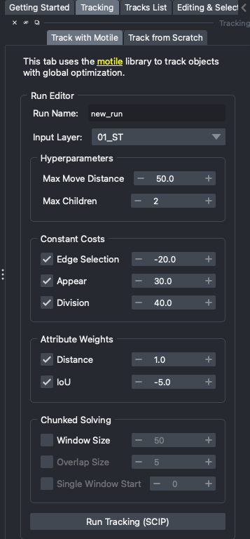
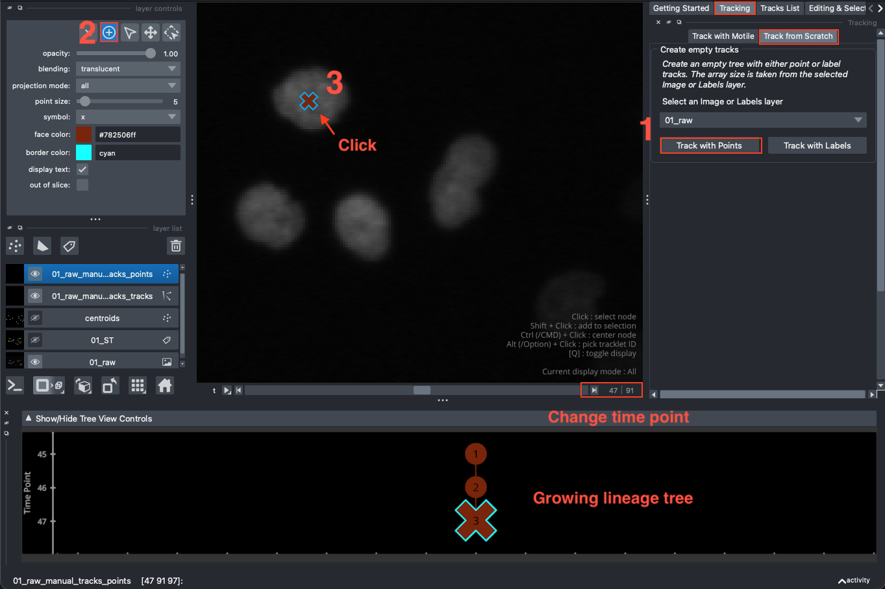
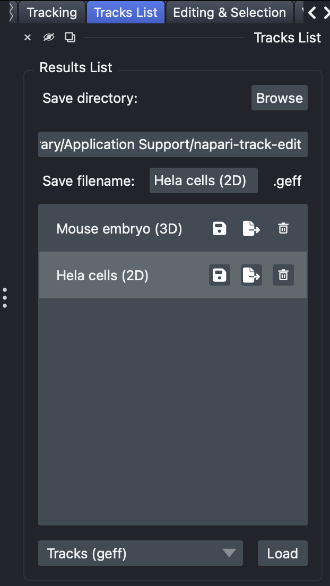

Generating new tracks
=====================

There are two ways to obtain a new tracking result from within the plugin, both
found in the ``Tracking`` widget: ``Track with Motile`` for automatic tracking on a Labels or Points layer,
and ``Track from Scratch`` for manual tracking on an image.
Tracks that were generated elsewhere can also be :doc:`imported <saving_loading>`.

Tracking with Motile
********************

Input data
----------
Motile does not perform detection: you must provide a Labels layer or a Points layer
containing the objects you want to track.
The Labels layer must have time as the first dimension followed by the spatial
dimensions (no channels).
The Points layer must have the point locations with time as the first number,
followed by the spatial dimensions. While source images are
nice to qualitatively evaluate results, they are not necessary to run tracking.
Make sure that your input layer has the correct scaling before starting the tracking,
since distances and :doc:`features <features>` are measured in scaled units.

In the future, we could also support Shapes layers as input (for example,
for bounding box tracking) - please react to
`Issue #48`_ if this is important to your use case, and give feedback on what type
of shape linking you want.

Run Editor
----------
``Track with Motile`` by default opens to the ``Run Editor`` view. In this view,
you can pick a name for your run, select an input layer, set
hyperparameters, and start a motile run. Hovering over the title of each
element in the widget will make a tooltip appear describing the purpose
of the element. All parameters are explained :ref:`below <motile-parameters>`.
When you are ready, click the ``Run Tracking`` button to start tracking. The button
also shows which solver will be used (e.g. ``Run Tracking (SCIP)``, or Gurobi
if it is installed, see :doc:`getting_started`).

   Tracking parameters in the Run Editor.

.. _motile-parameters:

Motile parameters
-----------------

Hyperparameters
~~~~~~~~~~~~~~~
The hyperparameters set up constraints on the optimization problem.
These constraints will never be violated by the solution.

- ``Max Move Distance`` - The maximum distance an object center can move between time frames, in scaled units. This should be an upper bound, as nothing further will be connected.
- ``Max Children`` - The maximum number of objects in the next time frames that an object can be linked to. Set this to 1 for tracking problems without divisions.

Constant Costs
~~~~~~~~~~~~~~
The constant costs contribute to the objective function that the optimization
problem will minimize. They are the same for all possible links in the
tracking problem, and should be set based on general properties of the problem.
Unchecking the checkbox will not include the cost in the objective at all,
while changing the weight values will change how much each cost contributes
to the objective.

- ``Edge Selection`` - A cost for linking any two objects between time frames. If you do not have many false positive detections, this value should be quite negative to encourage selecting as many linking edges as possible. If none of your costs are negative, the objective function will be minimized by selecting nothing (which has cost 0), so this cost can control generally how many edges/links are selected.
- ``Appear`` - A cost for starting a new track. Assuming tracks should be long and continuous, the appear cost should be positive. A high appear cost encourages continuing tracks where possible, but can lead to not selecting short tracks at all.
- ``Division`` - A cost for dividing, where a higher division cost will lead to fewer divisions. If your task does not have divisions, this cost does not matter - you can un-check it for clarity, but including it will do nothing.

Attribute weights
~~~~~~~~~~~~~~~~~
The attribute-based costs also contribute to the objective function that
the optimizer will minimize. Every possible link in the tracking problem
will have a different cost based on the specific attributes (distance or IoU)
of that pair of detections. Unchecking the checkbox will not include the
feature in the objective. The user-provided weight values will be multiplied by
the attribute values to generate the cost for linking a specific pair of
detections.

- ``Distance`` - Use the distance between objects as a feature for linking. The provided weight will be multiplied by the distance between objects to get the cost for linking the two objects. This weight should usually be positive, so that higher distances are more costly.
- ``IoU`` - Use the Intersection over Union between objects as a feature for linking. This option only applies if your input is a segmentation. The provided weights will be multiplied by the IoU to get the cost for linking two objects. This weight should usually be negative, so that higher IoUs are more likely to be linked.

Run Viewer
----------
Clicking the ``Run Tracking`` button will automatically take you to the motile ``Run Viewer``
menu, display a points and a tracks layer in the napari viewer, and populate the Lineage
View. If your input was a segmentation, there will also be
a new segmentation layer where the IDs have been relabeled to match across time, and the
input segmentation layer will be hidden to avoid confusion.

The ``Run Viewer`` contains the following information:

- The ``Solver status`` label, which will display if the solver is in progress or
  done solving.
- The ``Graph of solver gap``, which is mostly for debugging purposes.
  The solver gap is an optimization value that should decrease at each iteration.
- The run settings, including ``Hyperparameters``, ``Costs``, and ``Attribute weights``.
- The ``Back to editing`` button, which will return you to the ``Run Editor`` in its
  previous state.
- The ``Edit this run`` button. This button will take you back to the ``Run Editor``,
  but will overwrite the previous settings with the settings of the run you are
  viewing.

You can :doc:`view the results <viewing>` using the synchronized napari layers and
Lineage View, and :doc:`edit the detections and links <editing>` to correct any mistakes
that you find. You can also re-run the tracking step with different parameters.
Re-running the motile tracking will only take into account the detection corrections
if you select the new labels/points layer as input: our next major feature to add
is incorporating the detection and linking corrections into the optimization task in a
more principled manner.

Node IDs
~~~~~~~~
If your input was a Labels layer, the ``node_id`` will be determined by segmentation label
id. If your original segmentation repeated labels across time, the application will
relabel them all to be unique, and the new label id will be used as the node id.
If your input was a Points layer, the ``node_id`` is simply the index of the
node in the list of points.

Tutorial video
**************
This video walks through tracking an example dataset from the `Cell Tracking Challenge`_
with motile, and viewing and editing the result.

.. raw:: html

  <iframe src="https://drive.google.com/file/d/1zHvO9inHw0Hlbwq5zmRX4qUnVuO21neo/preview" width="640" height="480" allow="autoplay"></iframe>

Tracking from scratch
*********************
Instead of automatic tracking, it is also possible to manually track from scratch.
The ``Track from Scratch`` tab of the ``Tracking`` widget offers the option to create an
empty tree that you can populate yourself by adding nodes as points or as segmentation
labels.

Select an ``Image`` (or ``Labels``) layer in the dropdown menu; its size and scale are
used for the new tracks. Then click either ``Track with Points`` or ``Track with Labels``.
Depending on your choice, this creates either an empty ``Points`` layer or an empty
``Labels`` layer, and a new entry ``<layer name>_manual_tracks`` in the ``Tracks List``.

- **Track with Points**: select the ``Add points`` tool in the layer controls, and click
  on an object to add a node. Move to the next time point, and click again on the same
  object: the new node is added to the current track, and you will see a growing lineage
  tree in the Lineage View.
- **Track with Labels**: select the paint brush and paint an object to add a node.
  Move to the next time point, and paint again with the same label: the new node is added
  to the same track.

Press ``M`` to start a new track. See :ref:`add-node` for all details on how new nodes
are added to the tracks, and :doc:`editing` for how to connect, break, and correct them.

   Manual tracking with Points.

The Tracks List
***************
Each tracking result, whether from motile, tracking from scratch, or loaded from disk,
is stored in the ``Tracks List`` widget.
These are the tracks that are stored in memory - if you run tracking multiple
times with different inputs or parameters, you can click back and forth
between the results here to compare them.
Deleting tracks you do not want to keep viewing (with the trash can button) is a good
idea, since these are stored in memory.
Tracks that were saved in previous sessions do not appear here until you load them from
disk with the ``Load`` button. See :doc:`saving_loading` for saving, loading, importing,
and exporting tracks.

   The Tracks List, with one entry per set of tracks.

.. _Issue #48: https://github.com/live-image-tracking-tools/napari-track-edit/issues/48
.. _Cell Tracking Challenge: https://celltrackingchallenge.net/
