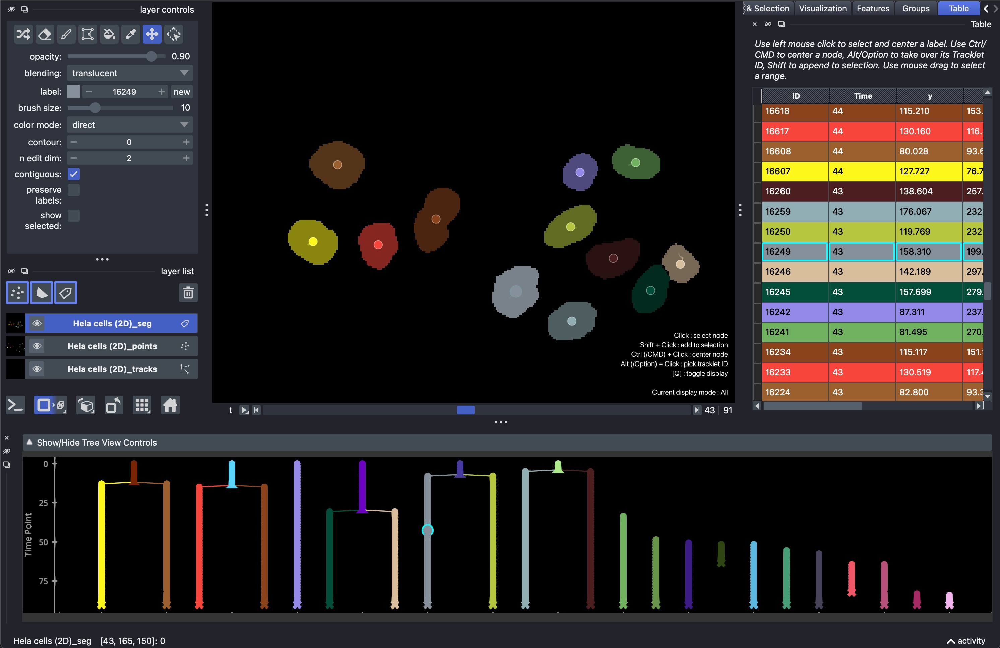
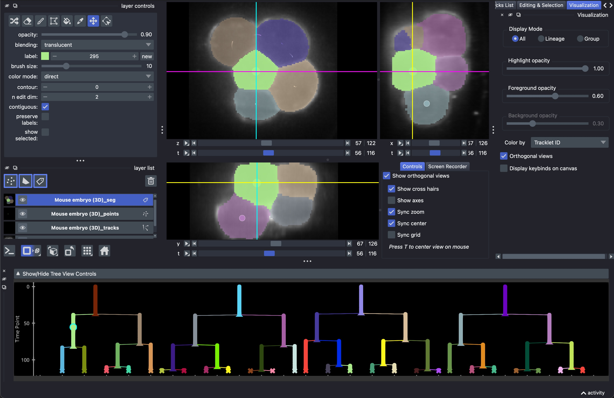
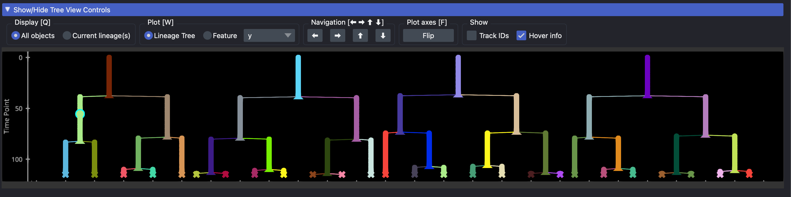
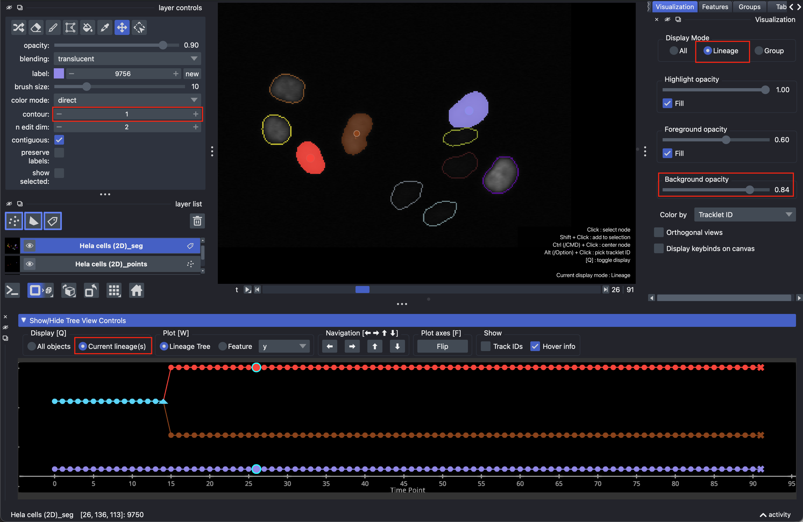

Viewing and navigating tracks
=============================

Napari Track Edit visualizes tracks (and segmentations) through synchronized napari
layers, a lineage tree view, and a table view. Selecting, centering, or filtering nodes
in one view is reflected in all the others.

Track visualization
*******************
Tracking results are displayed with:

- a **Points** layer, with nodes color-coded by tracklet ID and with symbols matching
  the state of the node:

  - △ dividing node
  - ✕ end point node
  - ◯ linear node

- an optional **Segmentation** (Labels) layer, with label values matching node ids,
  but color-coded by tracklet ID
- a **Tracks** layer, with tracks color-coded by tracklet ID
- a **Lineage View**, available from ``Plugins`` > ``Napari Track Edit`` > ``Widget - Lineage View``,
  with nodes and edges color-coded by tracklet ID and with symbols matching the state of nodes
- a **Table View**, available from ``Plugins`` > ``Napari Track Edit`` > ``Widget - Table``,
  with all object properties.

   Viewing HeLa Cells (2D) sample tracks with the Table widget active

   Viewing Mouse Embryo (3D) sample tracks with orthogonal views enabled

Tracklets and lineages
-------------------------------
Every node belongs to a *tracklet* and a *lineage*. A tracklet is a linear stretch of
a track between divisions: when a node divides, each child starts a new tracklet with
its own tracklet ID. A lineage is the whole tree of connected tracklets that descend from
the same ancestor. The tracklet ID determines the color of a node in all views, and
it is also the "current track ID" used when :ref:`adding new nodes <add-node>`.

.. _selecting-nodes:

Selecting nodes
***************
You can select one or multiple nodes for closer inspection. Selection of nodes is
possible in the Points and Labels layers, in the Lineage View, and in the Table view.
Clicking on an individual node will select that node, highlighting it in all views.
The view is centered on the selected node only when a single node is selected.

- Use ``SHIFT + click`` to add/remove nodes to/from the selection without centering.
- Use ``CTRL(/CMD) + click`` to center the view on a node without changing the selection.
- Use ``ALT(/OPTION) + click`` to adopt a node's tracklet id as the current one without
  selecting the node: this works like the pipette tool of the Labels layer, but it can
  be used on a node in any time point, so neither the current time point nor the camera moves.
- To select many nodes at once, use ``SHIFT + mouse drag`` in the Lineage View,
  mouse drag with the 'select points' tool active in the Points layer, or mouse drag
  in the Table view.

Selection controls
------------------
The ``Selection`` section at the bottom of the ``Editing & Selection`` widget offers
the following controls:

- ``Invert selection``: select all nodes that are not in the current selection.
- The arrow buttons: when multiple nodes are selected, cycle through them, centering
  the view on each one in turn.
- ``Deselect [ESC]``: clear the selection.
- ``Restore selection [E]``: restore the last selection.
- ``Previous Selection [P]`` and ``Next Selection [N]``: jump back/forward through your
  selection history. The back/forward side buttons of your mouse do the same.

.. _lineage-view:

Lineage View
************
The Lineage View shows the tracks as lineage trees, with time on one axis and the
tracklets laid out next to each other on the other axis. It opens at the bottom of the
viewer with ``Open all widgets``, or separately via ``Plugins`` > ``Napari Track Edit`` >
``Widget - Lineage View``.

   Lineage View widget with unfolded controls panel

- **Scroll** to zoom in or out. Hold ``X`` or ``Y`` while scrolling to restrict zooming
  to one axis, or drag with the right mouse button to squeeze/stretch the axes.
- **Mouse drag** to pan, and **right mouse click** to reset the view.
- **Hover** over a node to see its node, track and lineage ID.

The ``Show/Hide Tree View Controls`` bar at the top of the Lineage View opens the
following controls:

- ``Display [Q]``: switch between ``All objects`` and ``Current lineage(s)``
  (see :ref:`display-modes`).
- ``Plot [W]``: switch between plotting the ``Lineage Tree`` and a ``Feature``
  (see :doc:`features`).
- ``Navigation``: select the node to the left/right, or move up/down through the tree.
  You can also use the arrow keys for this (make sure to click on the tree widget first).
  In the view of all lineages, up and down select the parent and child node; in the view of
  the selected lineages, they jump to the next or previous adjacent lineage.
- ``Plot axes [F]``: flip the axes of the plot.
- ``Show``: toggle labelling the track axis with the ``Track IDs``, and the ``Hover info``
  tooltip.

.. _table-view:

Table view
**********
The ``Table`` widget lists all nodes with their time point, position, tracklet and
lineage IDs, and any :doc:`features <features>` you have measured. Rows are colored by
tracklet ID. The table follows the same mouse conventions as the other views:

- Left mouse click selects and centers a node.
- ``CTRL/CMD + click`` centers the view on a node, ``ALT/OPTION + click`` takes over
  its tracklet ID, and ``SHIFT + click`` appends it to the selection.
- Mouse drag selects a range of rows.
- Click on a column header to sort the table by that column.

The editing and selection keyboard shortcuts also work when the table has focus.

.. _display-modes:

Viewing all nodes vs. selected lineages
***************************************
Especially in crowded datasets, it can help to restrict the display to only the lineages
you are interested in. This can be done independently in the napari layers and in the
Lineage View.

In the **napari layers**, the ``Display Mode`` in the ``Visualization`` widget has three
options:

- ``All``: display all nodes.
- ``Lineage``: display only the lineages that contain at least one selected node.
- ``Group``: display only the nodes in the currently selected :doc:`group <groups>`.

Pressing ``Q`` in the napari viewer cycles through these modes (All → Lineage → Group → All;
when no groups exist, it alternates only between All and Lineage).

In the **Lineage View**, the ``Display`` controls switch between ``All objects``, which
shows all lineages (vertically), and ``Current lineage(s)``, which shows only the lineages
of the selected nodes (horizontally). Pressing ``Q`` with the Lineage View focused toggles
between the two.

   Display mode 'Lineage' in the ``Visualization`` widget, and 'Current lineage(s)' in
   the Lineage View. Here, the ``contour`` value of the Labels layer is set to 1, so that
   the ``Fill`` checkboxes and the ``Background opacity`` slider control whether labels are
   drawn filled or as contours (see :ref:`visualization-widget`).

.. _visualization-widget:

Visualization options
*********************
The ``Visualization`` widget contains further display options for the napari layers.
If the tracks have a segmentation, the following options control how its labels are shown:

- ``Highlight opacity``: the opacity of the selected labels.
- ``Foreground opacity``: the opacity of the displayed labels that are not selected.
- ``Background opacity``: the opacity of the labels outside the displayed lineages or
  group. Only available in the ``Lineage`` and ``Group`` modes; set it to 0 to hide them
  entirely.
- ``Fill``: only shown in the ``Lineage`` and ``Group`` modes when the Labels layer
  ``contour`` value (in the layer controls) is larger than 0. When checked, the
  highlighted or foreground labels are filled instead of showing their contours only.

The remaining options apply to all tracks:

- ``Color by``: the node feature used to color the labels, points, tracks, tree and table.
  You can color by tracklet ID (default), lineage ID, membership of a :doc:`group <groups>`,
  or choose ``None`` to paint every node in one flat color.
- ``Orthogonal views``: show orthogonal views of the data next to the main view.
  Press ``T`` to center all views on the mouse cursor. For 2D + time data, the ortho views
  show the time axis.
- ``Display keybinds on canvas``: show or hide the text overlay with the most important
  key bindings and the current display mode.
